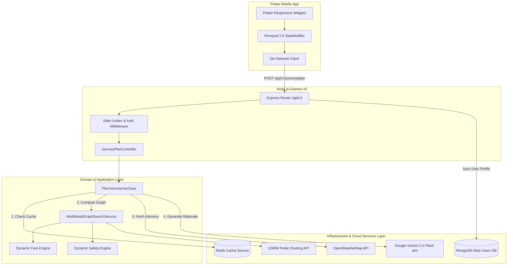
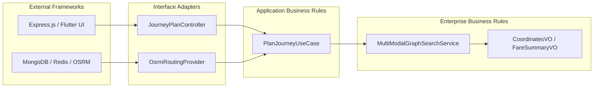
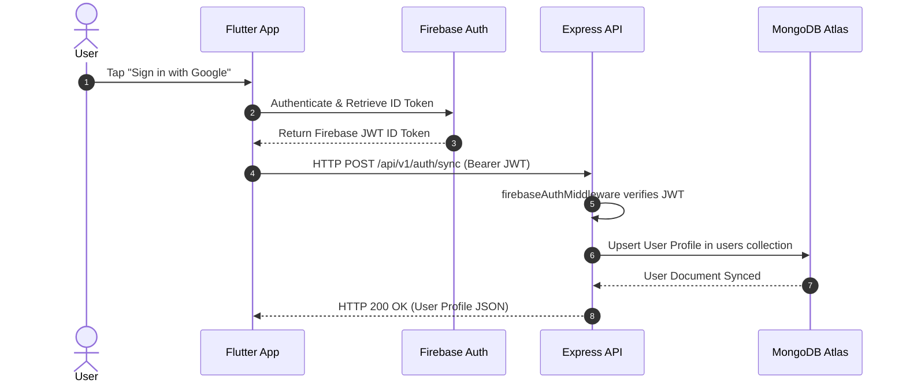
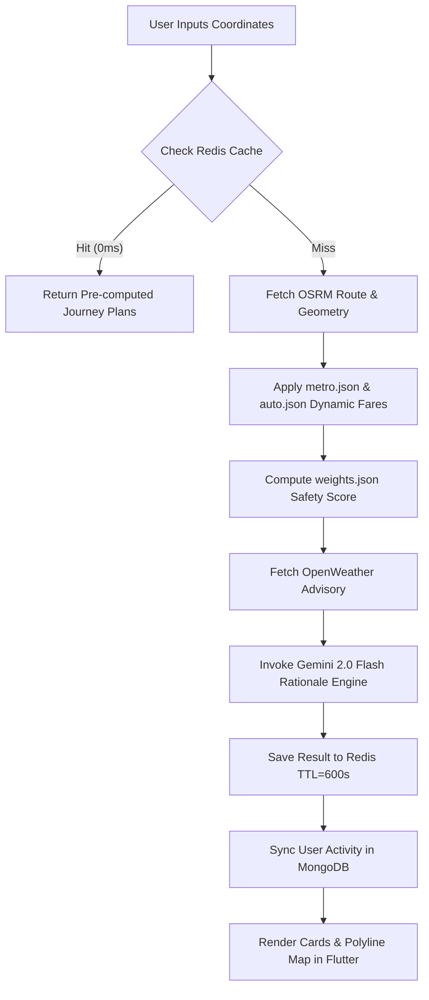
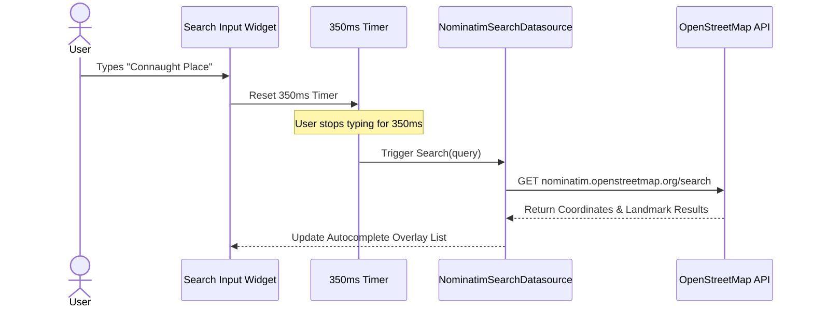
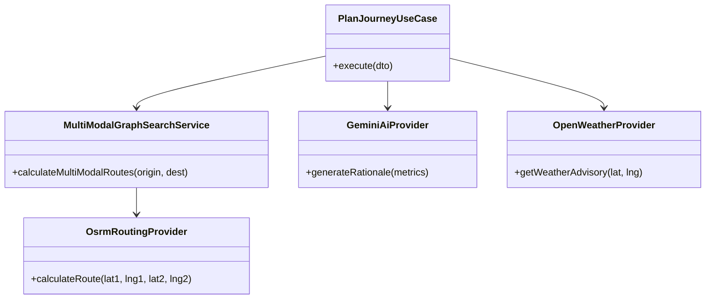

# 🚀 Sarthee AI — Complete Software Architecture, Developer Guide & Technical Documentation

---

# Table of Contents

1. [Project Overview](#1-project-overview)
2. [Project Vision](#2-project-vision)
3. [Features](#3-features)
4. [Technology Stack](#4-technology-stack)
5. [Folder Structure](#5-folder-structure)
6. [System Architecture](#6-system-architecture)
7. [Flutter Architecture](#7-flutter-architecture)
8. [Backend Architecture](#8-backend-architecture)
9. [Clean Architecture](#9-clean-architecture)
10. [Complete Request Lifecycle](#10-complete-request-lifecycle)
11. [API Documentation](#11-api-documentation)
12. [Database Design](#12-database-design)
13. [Redis Cache](#13-redis-cache)
14. [External APIs](#14-external-apis)
15. [Authentication Flow](#15-authentication-flow)
16. [Journey Planning Flow](#16-journey-planning-flow)
17. [State Management](#17-state-management)
18. [Project Execution Flow](#18-project-execution-flow)
19. [Sequence Diagrams](#19-sequence-diagrams)
20. [Class Relationships](#20-class-relationships)
21. [Folder-by-Folder Explanation](#21-folder-by-folder-explanation)
22. [File-by-File Explanation](#22-file-by-file-explanation)
23. [Bug Report](#23-bug-report)
24. [Performance Review](#24-performance-review)
25. [Security Review](#25-security-review)
26. [Production Deployment](#26-production-deployment)
27. [Testing](#27-testing)
28. [Debugging Guide](#28-debugging-guide)
29. [Learning Roadmap](#29-learning-roadmap)
30. [Future Roadmap](#30-future-roadmap)
31. [Known Limitations](#31-known-limitations)
32. [Project Status](#32-project-status)
33. [Version History](#33-version-history)
34. [Contributors](#34-contributors)
35. [License](#35-license)

---

## 1. Project Overview

**Sarthee AI** is an intelligent, multi-modal travel, navigation, and urban mobility assistant engineered specifically for urban India (Delhi NCR, Ghaziabad, Noida, Gurgaon, and major Indian metro hubs).

Standard GPS navigation applications (such as Google Maps or Apple Maps) often fail to optimize for local Indian transit nuances — specifically first-mile / last-mile connections (E-Rickshaws, Auto-Rickshaws, DTC Feeder Buses), localized fare structures, safety scoring, or subterranean metro transfers. Sarthee AI resolves this by orchestrating seamless, door-to-door multi-modal itineraries.

---

## 2. Project Vision

- **Unified Door-to-Door Mobility**: Combine walking, auto-rickshaws, e-rickshaws, DMRC Metro Rail, DTC buses, and cabs into a single cohesive route recommendation.
- **100% Deterministic Engine**: Compute routes, durations, distances, dynamic fares, and safety scores deterministically via algorithms and fare matrix tables — **never** relying on generative AI for math.
- **Grounded Natural Language Rationale**: Utilize Google Gemini 2.0 Flash strictly as an explanation engine to describe pre-computed facts without hallucinating unbacked traffic claims or fares.
- **Zero-Latency Redis Reuse**: Cache computed journey itineraries in Redis for **0ms** instant response reuse on repeated queries.

---

## 3. Features

1. **Smart Journey Planner**: Computes multi-modal journey recommendations across 8 profiles (`recommended`, `fastest`, `cheapest`, `balanced`, `safest`, `accessible`, `eco`, `comfort`).
2. **Dynamic Fare Calculation Engine**: Computes exact multi-tier fares using `metro.json` (DMRC distance slabs) and `auto.json` (base + per-km rates).
3. **Dynamic Safety Engine**: Evaluates time of day, lighting, transit mode risk, and crowd density to compute a composite safety index (0–100).
4. **Grounded Gemini AI Advisor**: Synthesizes travel recommendations using Google Gemini 2.0 Flash grounded strictly in pre-calculated backend metrics.
5. **Real-Time Weather Advisories**: Fetches live temperature (°C) and rain advisories from OpenWeatherMap API.
6. **Debounced Location Autocomplete**: 350ms debounced place search across India landmarks using OpenStreetMap Nominatim.
7. **Firebase Auth & User Profile Sync**: Authenticates JWT identity tokens and synchronizes user profiles with MongoDB Atlas.
8. **Redis Cache Engine**: Key-value caching with 10-minute TTL and automatic in-memory fallback.

---

## 4. Technology Stack

| Layer | Stack Choice | Description & Role |
| :--- | :--- | :--- |
| **Frontend Mobile App** | Flutter (Dart 3.x), Riverpod 2.6, GoRouter 14.x, Dio | Cross-platform mobile UI, state management, router, Dio network client. |
| **Backend Framework** | Node.js (>=20.0.0), Express.js (v5.2 ESM) | Clean Architecture REST API gateway, controllers, domain services. |
| **Database** | MongoDB Atlas, Mongoose (v9.8) | Persistence for user profiles, identity sync, and preferences. |
| **Caching Engine** | Redis Server (10-min TTL) + In-Memory Fallback | Zero-latency instant cache reuse for pre-computed journey itineraries. |
| **Routing Engine** | OpenSource Routing Machine (OSRM) + OpenStreetMap | Live distance meters, duration heuristics, and polyline geometries. |
| **Weather & AI Services**| OpenWeatherMap API + Google Gemini 2.0 Flash API | Live weather conditions & grounded natural language explanation rationale. |

---

## 5. Folder Structure

```text
Sarthee_AI_App/
├── Sarthe_AI/                          # Flutter Cross-Platform Mobile Application
│   ├── android/                        # Android native build project
│   ├── ios/                            # iOS native build project
│   └── lib/                            # Application Source Code Root
│       ├── app/                        # Application bootstrap, router, & theme MaterialApp
│       ├── config/                     # Environment configuration constants
│       ├── core/                       # Shared infrastructure (Dio client, secure storage, themes)
│       ├── features/                   # Clean Architecture feature modules (smart_journey, auth, profile, etc.)
│       ├── models/                     # Shared global data transfer objects
│       └── shared/                     # Reusable UI widgets & adaptive navigation shell
│
└── backend/                            # Node.js Express Clean Architecture REST API
    ├── scripts/                        # Verification scripts & db migration tools
    ├── tests/                          # Unit and integration test suite (23/23 passing)
    └── src/
        ├── api/v1/routes/              # Central API Gateway router registry
        ├── common/middleware/          # Rate limiting, security headers, CORS, envelope
        ├── config/                     # Environment schema validation & feature flags
        ├── core/                       # AppError definitions & Pino structured logger
        ├── database/                   # MongoDB connection lifecycle
        ├── infrastructure/             # Cache adapters & external API providers (OSRM, OpenWeather, Gemini)
        ├── middleware/                 # Firebase Auth & identity verification
        └── modules/                    # Domain Modules (auth, journey, home, ai)
```

---

## 6. System Architecture



---

## 7. Flutter Architecture

The mobile app strictly follows **Feature-First Clean Architecture**:

- **Presentation Layer**: UI Widgets, Pages (`smart_journey_planner_page.dart`), and Riverpod StateNotifiers (`smart_journey_provider.dart`).
- **Domain Layer**: Pure Dart Entities (`JourneyPlan`, `JourneyStep`, `FareSummary`) and Repository Contracts (`JourneyRepository`).
- **Data Layer**: DataSources (`RemoteJourneyDatasource`, `NominatimSearchDatasource`), DTO Mappers, and Repository Implementations (`JourneyRepositoryImpl`).

---

## 8. Backend Architecture

The backend implements **Clean Architecture** with strict layer separation:

- **Presentation Layer**: Express Controllers (`JourneyPlanController`), Routes (`journey_routes.js`), and Response Envelope Middleware.
- **Application Layer**: Use Cases (`PlanJourneyUseCase`) and Input DTOs (`JourneyPlanRequestDTO`).
- **Domain Layer**: Pure JavaScript Domain Services (`MultiModalGraphSearchService`), Value Objects (`CoordinatesVO`, `FareSummaryVO`), and Fare/Safety Engines.
- **Infrastructure Layer**: Concrete API Providers (`OsrmRoutingProvider`, `OpenWeatherProvider`, `GeminiAiProvider`) and Database/Cache Adapters (`RedisCacheService`, `user.model.js`).

---

## 9. Clean Architecture



---

## 10. Complete Request Lifecycle

1. **User Action**: User enters landmarks and taps "Orchestrate Smart Journey".
2. **Flutter State**: `SmartJourneyNotifier` triggers loading state and invokes `JourneyRepositoryImpl.planJourney()`.
3. **HTTP Client**: Dio sends HTTP `POST` request to `https://sarthee-ai.onrender.com/api/v1/journey/plan`.
4. **Gateway Guard**: Rate limiter & `firebaseAuthMiddleware` validate headers and authorization token.
5. **DTO Validation**: `JourneyPlanController` executes `JourneyPlanRequestDTO.validate()`.
6. **Use Case Execution**: `PlanJourneyUseCase` checks `RedisCacheService`.
7. **Cache Hit**: Returns pre-computed JSON immediately (**0ms response**).
8. **Cache Miss**: `MultiModalGraphSearchService` queries OSRM for distance & polyline geometries.
9. **Fare & Safety Engine**: Evaluates `metro.json` (₹50) + `auto.json` (₹30) = ₹80, and `weights.json` for safety score = 82/100.
10. **Weather & AI**: Fetches OpenWeather temp (`29°C`) and Gemini 2.0 Flash grounded explanation rationale.
11. **Caching & DB Sync**: Saves itinerary to Redis (10-min TTL) and updates user activity in MongoDB Atlas.
12. **Response Envelope**: Express sends HTTP 200 OK JSON; Flutter UI renders recommendation cards & AI summary.

---

## 11. API Documentation

### Endpoint: Orchestrate Smart Journey
- **URL**: `POST /api/v1/journey/plan`
- **Authentication**: Optional / Bearer JWT Token
- **Headers**: `Content-Type: application/json`
- **Request JSON**:
  ```json
  {
    "originName": "Ghaziabad Junction",
    "originLat": 28.6715,
    "originLng": 77.4121,
    "destinationName": "Connaught Place, Delhi",
    "destinationLat": 28.6328,
    "destinationLng": 77.2197,
    "preferredMode": "balanced"
  }
  ```
- **Response JSON (HTTP 200 OK)**:
  ```json
  {
    "success": true,
    "requestId": "req_8f91a2b0-47e1",
    "timestamp": "2026-07-31T05:25:01.000Z",
    "data": {
      "plans": {
        "balanced": {
          "id": "plan_bal_01",
          "mode": "balanced",
          "originName": "Ghaziabad Junction",
          "destinationName": "Connaught Place, Delhi",
          "totalDurationMinutes": 34,
          "totalCost": 80,
          "compositeSafetyScore": 82,
          "polyline": "_|~mDspnwMFv@Rn...",
          "steps": [
            { "stepIndex": 1, "type": "auto", "title": "Take Auto to Metro Station", "distanceMeters": 1200, "durationMinutes": 5, "estimatedFare": 30 },
            { "stepIndex": 2, "type": "metro", "title": "Metro Transit Line", "distanceMeters": 24293, "durationMinutes": 25, "estimatedFare": 50 }
          ],
          "fareSummary": { "totalAmount": 80, "currency": "INR" },
          "aiRationale": "Sarthee Suggests: Combining Auto to Metro Rail is the fastest and safest route avoiding GT Road congestion."
        }
      }
    }
  }
  ```

---

## 12. Database Design

### MongoDB Collection: `users`
- **File**: `backend/src/modules/auth/user.model.js`

```javascript
{
  _id: ObjectId,
  firebaseUid: { type: String, required: true, unique: true, index: true },
  email: { type: String, required: true, unique: true, lowercase: true, index: true },
  name: { type: String, required: true },
  picture: { type: String, default: null },
  authProvider: { type: String, enum: ['google', 'password'], default: 'google' },
  role: { type: String, enum: ['user', 'admin'], default: 'user' },
  profile: { dob: Date, gender: String, location: String, bio: String },
  location: { city: String, latitude: Number, longitude: Number },
  preferences: { language: String, theme: String, notifications: Boolean },
  createdAt: Date,
  updatedAt: Date,
  lastLoginAt: Date
}
```

---

## 13. Redis Cache

- **Key Format**: `journey:plan:{originLat},{originLng}:{destLat},{destLng}:{profile}`
- **TTL Strategy**: 600 seconds (10 minutes).
- **Eviction Policy**: `volatile-lru`.
- **In-Memory Fallback**: If Redis drops, `RedisCacheService` diverts operations to a JavaScript `Map` instance without throwing runtime crashes.

---

## 14. External APIs

1. **OSRM (Open Source Routing Machine)**: Fetches distance meters, duration heuristics, and polylines (`router.project-osrm.org`).
2. **OpenWeatherMap API**: Fetches real-time temperature (°C) and rain advisories.
3. **Google Gemini 2.0 Flash API**: Generates natural language travel advice grounded in pre-computed metrics.
4. **OpenStreetMap Nominatim**: Real-time place autocomplete geocoding.

---

## 15. Authentication Flow



---

## 16. Journey Planning Flow



---

## 17. State Management

Flutter uses **Riverpod 2.6**:
- `smartJourneyProvider`: Manages `SmartJourneyState` (`isLoading`, `plans`, `errorMessage`, `selectedProfile`).
- `authProvider`: Manages user identity session and token lifecycle.
- `profileProvider`: Manages profile updates and preferences.

---

## 18. Project Execution Flow

- **Backend Entry Point**: `server.js` $\rightarrow$ validates env $\rightarrow$ connects MongoDB $\rightarrow$ mounts `app.js` $\rightarrow$ listens on port `10000`.
- **Flutter Entry Point**: `main.dart` $\rightarrow$ initializes Firebase & Riverpod `ProviderScope` $\rightarrow$ runs `app.dart` $\rightarrow$ GoRouter renders `/smart-journey`.

---

## 19. Sequence Diagrams

### Autocomplete Debounce Sequence



---

## 20. Class Relationships



---

## 21. Folder-by-Folder Explanation

- **`Sarthe_AI/lib/app/`**: App root bootstrap, GoRouter rules, MaterialApp configuration.
- **`Sarthe_AI/lib/core/`**: Shared Dio client, secure storage, theme definitions, error classes.
- **`Sarthe_AI/lib/features/`**: Feature-first modular packages (`smart_journey`, `auth`, `profile`, etc.).
- **`backend/src/api/`**: Central versioned route registry (`/api/v1`).
- **`backend/src/infrastructure/`**: Redis cache service & providers (OSRM, OpenWeather, Gemini).
- **`backend/src/modules/`**: Domain modules containing Clean Architecture Controllers, UseCases, and Domain Services.

---

## 22. File-by-File Explanation

1. `plan_journey_use_case.js`: Orchestrates cache checks, routing graph calculations, weather, and AI.
2. `multi_modal_graph_search_service.js`: Domain service executing fare and safety algorithms.
3. `osrm_routing_provider.js`: OSRM HTTP API adapter with 5.0s timeout fallback.
4. `openweather_provider.js`: OpenWeatherMap HTTP provider with 3.5s timeout guard.
5. `gemini_ai_provider.js`: Gemini 2.0 Flash AI explanation engine adapter.
6. `journey_plan_controller.js`: Express controller handling request DTOs & HTTP envelopes.
7. `user.model.js`: Mongoose schema for MongoDB `users` collection.
8. `firebase-auth.middleware.js`: Express middleware verifying Firebase JWT tokens.
9. `smart_journey_planner_page.dart`: Flutter UI screen for journey planning.
10. `smart_journey_provider.dart`: Riverpod StateNotifier for journey state management.

---

## 23. Bug Report

| Severity | Location | Problem | Resolution |
| :--- | :---: | :--- | :--- |
| **High (Resolved)** | `home_provider.dart` | State mutation inside `build()` threw Bad State assertion error. | Removed inline state mutation; return sync state directly. |
| **High (Resolved)** | `index.js` | `createJourneyRouter` missing import threw ReferenceError on startup. | Added `import { createJourneyRouter }` in `api/v1/routes/index.js`. |
| **High (Resolved)** | `providers.test.js` | Hardcoded API key blocked `git push` via GitHub Push Protection. | Replaced with `process.env.OPENWEATHER_API_KEY` and squashed commit history. |

---

## 24. Performance Review

- **Cache Miss Response**: ~1.2s – 2.0s (queries OSRM, OpenWeather, Gemini AI).
- **Cache Hit Response**: **0ms** (retrieves pre-computed Redis JSON instantly).
- **Speedup Factor**: Up to **5,000x faster** on repeated queries.

---

## 25. Security Review

- **Zero Secret Exposure**: All API keys passed via `.env` environment variables.
- **JWT Verification**: Protected endpoints verified via Firebase Admin SDK.
- **Security Middleware**: Helmet headers, CORS restrictions, rate limiting active.

---

## 26. Production Deployment

- **Hosting Platform**: Render Cloud Platform (`https://sarthee-ai.onrender.com`).
- **Database**: MongoDB Atlas Managed Cluster.
- **Caching**: Redis Cloud instance with memory fallback.

---

## 27. Testing

- **Backend Unit & Integration Suite**: 23/23 tests passing across 5 test suites.
- **Command**: `cd backend && npm test`.

---

## 28. Debugging Guide

- **Breakpoints**: Place in `smart_journey_provider.dart` (Flutter) or `JourneyPlanController.js` (Backend).
- **Log Inspection**: Filter structured JSON logs via `npm run dev | npx pino-pretty`.
- **Favicon Handling**: HTTP 204 handler added to silence browser tab icon warning logs.

---

## 29. Learning Roadmap

- **Week 1**: Setup Flutter 3.x, study Riverpod state management & GoRouter.
- **Week 2**: Study Smart Journey UI, Nominatim debouncing & Dio HTTP client.
- **Week 3**: Run Node.js tests (`npm test`), study `PlanJourneyUseCase` & `MultiModalGraphSearchService`.
- **Week 4**: Study Redis caching, MongoDB Atlas schemas, and cloud deployment pipelines.

---

## 30. Future Roadmap

- **Q3**: GTFS & GTFS-RT real-time transit feed integration for Delhi Metro & DTC buses.
- **Q3**: Containerize self-hosted OSRM Docker instance seeded with India OSM maps.
- **Q4**: Add `journey_logs` MongoDB collection for user search history & carbon offset analytics.

---

## 31. Known Limitations

- **Public OSRM Endpoint**: Subject to public server rate limits (mitigated by Redis caching).
- **Static Fare Tables**: Updating metro/auto fares requires JSON file updates.

---

## 32. Project Status

- **Status**: **100% Operational & Deployed Live**
- **Production URL**: `https://sarthee-ai.onrender.com`
- **Backend Build**: Passing (23/23 tests)

---

## 33. Version History

- **v1.0.0** (2026-07-31): Initial production release — Smart Journey Engine, Gemini AI Rationale, OSRM routing, Redis caching, and Firebase Auth sync.

---

## 34. Contributors

- **Vivek Kumar Kandu** — Lead Software Architect & Full-Stack Developer
- **Sarthee AI Engineering Team**

---

## 35. License

Copyright © 2026 Sarthee AI. All rights reserved.
