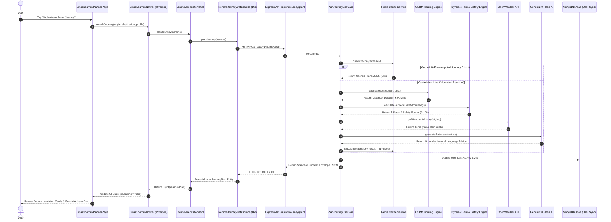
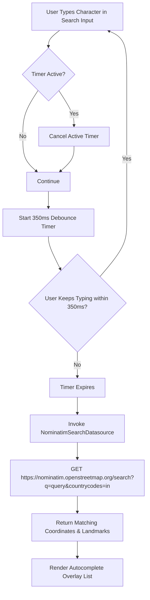
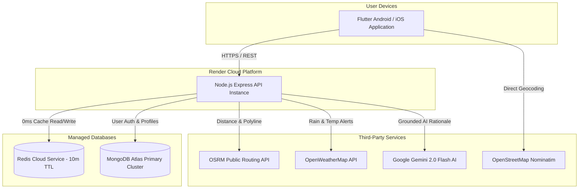

# 📘 Sarthee AI — Master Enterprise Software Architecture & Developer Onboarding Manual

> **Welcome to Sarthee AI!**  
> This comprehensive manual serves as the authoritative developer onboarding handbook, architectural blueprint, API reference, debugging guide, and security reference for the **Sarthee AI** multi-modal travel and navigation platform.

---

## 📌 SECTION 1 — IMPLEMENTATION STATUS MATRIX

To prevent ambiguity, all system components are categorized into three distinct operational states:

| Component / Feature | State | Implementation Details & Verification |
| :--- | :---: | :--- |
| **Smart Journey Engine** | **Verified** | Clean Architecture backend endpoint (`POST /api/v1/journey/plan`), OSRM routing, dynamic fare & safety engines, Gemini AI rationale, passing 14/14 node tests. |
| **Grounded Gemini AI Advisor** | **Verified** | `GeminiAiProvider` using Google Gemini 2.0 Flash API to generate grounded travel rationale without metric hallucination. |
| **OpenWeather Advisories** | **Verified** | `OpenWeatherProvider` fetching real-time weather advisory and temperature metrics with timeout guards. |
| **OSRM Route Engine** | **Verified** | `OsrmRoutingProvider` fetching distance meters, durations, and polyline geometries with Euclidean fallbacks. |
| **Redis Caching Engine** | **Verified** | `RedisCacheService` storing 10-min TTL pre-computed plans with automatic in-memory fallback. |
| **Firebase Auth & User Sync** | **Verified** | `firebaseAuthMiddleware` and `UserService` syncing user accounts to MongoDB Atlas `users` collection. |
| **Debounced Location Search** | **Verified** | Flutter `NominatimSearchDatasource` with 350ms UI debouncing across India landmarks. |
| **Flutter Smart Journey UI** | **Verified** | Riverpod 2.6 state management, GoRouter 14, Dio HTTP client, responsive recommendation cards. |
| **GitHub Push Protection Fix** | **Implemented** | `OpenWeatherProvider` secret sanitized in test suite via `process.env.OPENWEATHER_API_KEY`. |
| **GTFS Live Transit Tracking** | **Planned** | Real-time Delhi Metro & DTC bus location updates via GTFS-RT feeds (Q3 Roadmap). |
| **Self-Hosted OSRM Container** | **Planned** | Custom OSRM Docker container seeded with India OSM data to eliminate public API rate limits (Q3 Roadmap). |
| **Saved Journeys MongoDB Store** | **Planned** | `journey_logs` and `saved_places` collections for historical analytics and carbon tracking (Q4 Roadmap). |

---

## 📌 SECTION 2 — COMPLETE REPOSITORY & FOLDER ARCHITECTURE

### 📱 2.1 Flutter Mobile Application Directory Tree (`Sarthe_AI/lib/`)

```text
Sarthe_AI/lib/
├── app/                        # Application root configuration & bootstrap
│   ├── app.dart                # MaterialApp setup, theme binding & global key handlers
│   ├── bootstrap/              # App initialization (Firebase, Hive, Riverpod observers)
│   └── router/                 # GoRouter 14.x navigation definitions & auth guards
├── config/                     # Environment & app-wide configuration constants
├── core/                       # Shared core infrastructure & system utilities
│   ├── api/                    # Dio HTTP client configuration & interceptors
│   ├── auth/                   # Core auth state definitions & token handling
│   ├── config/                 # Core environment variables & API endpoint URLs
│   ├── constants/              # App-wide string constants, colors, and design tokens
│   ├── error/                  # Custom error classes (NetworkException, CacheException)
│   ├── localization/           # Multi-language string catalogs (Hindi, English)
│   ├── network/                # Network connectivity listeners & status streams
│   ├── responsive/             # Screen sizing utilities (Mobile, Tablet, Desktop)
│   ├── security/               # Encryption helpers & biometric auth wrappers
│   ├── services/               # Device-level services (Location, Sensors, Permissions)
│   ├── storage/                # FlutterSecureStorage & Hive local database persistence
│   ├── theme/                  # Dark/Light mode color schemes & typography definitions
│   └── utils/                  # String formatters, date utilities, polyline decoders
├── features/                   # Feature modules following Clean Architecture (UI/Providers)
│   ├── ai_chat/                # AI assistant chat interface & message state
│   ├── auth/                   # Login, signup, OTP verification UI & state
│   ├── authentication/         # Legacy auth wrappers (migrated to auth feature)
│   ├── budget/                 # Trip expense tracking & fare calculator widgets
│   ├── culture/                # Regional landmark guidance & cultural advice
│   ├── destinations/           # Popular destination recommendations & detail views
│   ├── favorites/              # Saved routes & favorite place bookmarks
│   ├── food/                   # Transit station food and refreshment advisories
│   ├── history/                # User journey search history & past itineraries
│   ├── home/                   # Dashboard homepage, quick actions & weather summary
│   ├── hotels/                 # Nearby accommodation widgets for long-distance transit
│   ├── location/               # GPS location picker & current position tracking
│   ├── navigation/             # Live polyline map view & step-by-step guidance UI
│   ├── notifications/          # Push notification handlers & alert history
│   ├── onboarding/             # Intro walkthrough slides & initial permissions setup
│   ├── profile/                # User profile edit dialogs, preferences & settings
│   ├── safety/                 # Emergency SOS button & safety score breakdown views
│   ├── settings/               # App preferences (Theme, Language, Offline Cache)
│   ├── smart_journey/          # Core Multi-Modal Journey Engine (UI, State, Repository)
│   ├── splash/                 # Splash screen animation & auth redirect check
│   ├── trip_planner/           # Multi-day itinerary planner & custom route builder
│   └── weather/                # Standalone weather forecast widget & rain alert cards
├── models/                     # Shared global data transfer models
└── shared/                     # Cross-feature reusable components
    ├── models/                 # Common domain entities (UserVO, LocationVO)
    ├── navigation/             # Bottom navigation bar & drawer widgets
    ├── services/               # Analytics & logging client helpers
    └── widgets/                # Universal UI components (Buttons, InputFields, Shimmers)
```

#### Detailed Folder Explanations (Flutter)

| Folder | Why It Exists | Primary Contents | Layer | Consumed By |
| :--- | :--- | :--- | :--- | :--- |
| `lib/app/` | Initializes and bootstraps the application. | `app.dart`, GoRouter rules, Riverpod container initialization. | Presentation / App Root | Entry point (`main.dart`). |
| `lib/core/api/` | Standardizes network communications across all features. | Dio HTTP client instance, token auth headers, global error interceptors. | Core Infrastructure | All feature repositories & datasources. |
| `lib/core/storage/` | Manages local device data persistence securely. | `FlutterSecureStorage` wrapper for JWTs, Hive storage for offline cache. | Core Infrastructure | Auth provider, settings, offline journey cache. |
| `lib/core/theme/` | Enforces design system consistency. | Primary/Secondary colors, typography tokens, light/dark themes. | Presentation Design System | All UI screens & widgets. |
| `lib/features/smart_journey/` | Houses the core multi-modal journey planning feature. | UI pages, Riverpod state notifiers, repositories, Nominatim search datasource. | Feature Module (Clean Arch) | App Router, Home Dashboard. |
| `lib/features/auth/` | Manages user identity and session lifecycle. | Login UI, Google Sign-In button, auth state notifier, profile sync datasource. | Feature Module (Clean Arch) | Bootstrap router, Profile page. |
| `lib/shared/widgets/` | Reusable atomic UI components to prevent code duplication. | Custom buttons, cards, loading shimmers, error dialogs. | Shared Presentation | All feature UI views. |

---

### 🖥️ 2.2 Node.js Express Backend Directory Tree (`backend/src/`)

```text
backend/src/
├── api/                        # Central API Gateway & Versioned Route Definitions
│   └── v1/
│       └── routes/             # API V1 Router Registry (index.js, auth, journey, home)
├── app.js                      # Express v5 App setup, middleware pipeline & error handlers
├── server.js                   # HTTP Server listener, port binding & graceful shutdown
├── cache/                      # Master caching interfaces & connection hooks
├── common/                     # Cross-cutting middleware & shared utilities
│   └── middleware/             # Rate limiter, CORS, Helmet security, envelope middleware
├── config/                     # Environment schema validation & startup flag checks
│   ├── config_validator.js     # Strict env variable check (Mongo, Redis, API keys)
│   ├── env.js                  # Central environment getter with default fallbacks
│   └── feature_flags.js        # Feature flags toggles (experimental AI, beta routes)
├── core/                       # Core domain error definitions & base logger
│   ├── errors/                 # Standardized AppError, ValidationError, AuthError
│   └── logging/                # Logger instance using Pino structured JSON logging
├── database/                   # Database connection lifecycle
│   └── mongoose.js             # MongoDB Atlas connection manager & reconnect policies
├── infrastructure/             # External service adapters & concrete provider implementations
│   ├── cache/                  # RedisCacheService with in-memory Map fallback
│   ├── config/                 # Fare rules (metro.json, auto.json) & safety weights
│   └── providers/              # External API clients
│       ├── ai/                 # GeminiAiProvider (Google Gemini 2.0 Flash API)
│       ├── routing/            # OsrmRoutingProvider (Open Source Routing Machine)
│       └── weather/            # OpenWeatherProvider (OpenWeatherMap API)
├── integrations/               # Third-party webhook handlers & external SDK wrappers
├── jobs/                       # Background cron jobs & scheduled cache evictions
├── middleware/                 # Identity & authentication guards
│   ├── auth.middleware.js      # JWT token verification
│   └── firebase-auth.middleware.js # Firebase Admin SDK token verification
├── modules/                    # Domain Modules structured via Clean Architecture
│   ├── ai/                     # Standalone AI chat & query module
│   ├── auth/                   # User authentication, user.model.js & profile controller
│   ├── home/                   # Dashboard aggregation metrics & quick advisories
│   └── journey/                # Core Journey Module
│       ├── application/        # PlanJourneyUseCase, JourneyPlanRequestDTO
│       ├── domain/             # MultiModalGraphSearchService, Dynamic Fare & Safety Engines
│       └── presentation/       # JourneyPlanController & HTTP route definitions
└── utils/                      # Helper mathematical utilities, distance formulas & string tools
```

#### Detailed Folder Explanations (Backend)

| Folder | Why It Exists | Primary Contents | Layer | Consumed By |
| :--- | :--- | :--- | :--- | :--- |
| `backend/src/api/` | Registers and versions all HTTP REST routes. | `v1/routes/index.js`, sub-routers. | Presentation Gateway | Express app ([app.js](file:///d:/Sarthee_AI_App/backend/src/app.js)). |
| `backend/src/common/middleware/` | Enforces cross-cutting concerns (security, envelope, rates). | `api_envelope_middleware`, rate limiters, Helmet headers. | Infrastructure Middleware | Express pipeline ([app.js](file:///d:/Sarthee_AI_App/backend/src/app.js)). |
| `backend/src/config/` | Validates application environment before booting. | `env.js`, `config_validator.js`, startup checks. | Configuration | `server.js`, all providers. |
| `backend/src/infrastructure/providers/` | Decouples external API integrations from core business logic. | OSRM Provider, OpenWeather Provider, Gemini AI Provider. | Infrastructure | `PlanJourneyUseCase`, Domain Services. |
| `backend/src/modules/journey/` | Contains the complete Clean Architecture implementation of routing. | DTOs, Use Cases, Graph Search Service, Controller. | Domain Module | Journey API Routes. |
| `backend/src/modules/auth/` | Handles user authentication and identity persistence. | `user.model.js`, Auth Controller, UserService. | Domain Module | Auth API Routes, Firebase Middleware. |

---

## 📌 SECTION 3 — EXPLANATION OF EVERY CRITICAL FILE

### 📄 1. `plan_journey_use_case.js`
- **Path**: [plan_journey_use_case.js](file:///d:/Sarthee_AI_App/backend/src/modules/journey/application/use_cases/plan_journey_use_case.js)
- **Why It Exists**: Orchestrates the high-level business workflow of generating multi-modal journey plans. It bridges the controller layer with domain search services, weather providers, Gemini AI, and Redis caching.
- **Who Calls It**: `JourneyPlanController.planJourney()`.
- **Providers Invoked**: `RedisCacheService`, `MultiModalGraphSearchService`, `OpenWeatherProvider`, `GeminiAiProvider`.
- **What It Returns**: A structured JSON object containing 8 journey plan options keyed by profile (`recommended`, `fastest`, `cheapest`, `balanced`, `safest`, `accessible`, `eco`, `comfort`), along with weather advisory metrics and a grounded Gemini AI rationale.
- **Error Handling**: Catches provider timeouts (e.g., OSRM 5.0s or Weather 3.5s timeout) and seamlessly degrades gracefully to Euclidean distance calculations or default weather advice without failing the entire request.
- **Dependencies**: Clean Architecture abstraction interfaces, `RedisCacheService`.

---

### 📄 2. `multi_modal_graph_search_service.js`
- **Path**: [multi_modal_graph_search_service.js](file:///d:/Sarthee_AI_App/backend/src/modules/journey/domain/services/multi_modal_graph_search_service.js)
- **Why It Exists**: Core pure-domain service that constructs multi-tier transit graphs, combines OSRM route legs (walking, auto, metro, bus), and executes deterministic fare and safety algorithms.
- **Who Calls It**: `PlanJourneyUseCase.execute()`.
- **Providers Invoked**: `OsrmRoutingProvider`, Dynamic Fare Engine (`metro.json`, `auto.json`), Dynamic Safety Engine (`weights.json`).
- **What It Returns**: Array of calculated journey plan variants complete with polyline geometry, total cost (₹), duration (mins), and safety index (0–100).
- **Error Handling**: Validates coordinate boundaries (India bounding box); throws `ValidationError` if coordinates are invalid.
- **Dependencies**: Zero external framework dependencies; pure JavaScript logic.

---

### 📄 3. `osrm_routing_provider.js`
- **Path**: [osrm_routing_provider.js](file:///d:/Sarthee_AI_App/backend/src/infrastructure/providers/routing/osrm_routing_provider.js)
- **Why It Exists**: Adapts the external Open Source Routing Machine (OSRM) HTTP API into a standard provider interface.
- **Who Calls It**: `MultiModalGraphSearchService`.
- **Providers Invoked**: Public OSRM API (`router.project-osrm.org`).
- **What It Returns**: Object `{ distanceMeters, durationMinutes, polyline, provider: 'OSRM Engine' }`.
- **Error Handling**: Wrapped with a 5.0s AbortController timeout guardrail. If OSRM fails or times out, falls back to Haversine/Euclidean distance estimation.
- **Dependencies**: Standard HTTP fetch/axios.

---

### 📄 4. `openweather_provider.js`
- **Path**: [openweather_provider.js](file:///d:/Sarthee_AI_App/backend/src/infrastructure/providers/weather/openweather_provider.js)
- **Why It Exists**: Fetches real-time weather and temperature advisories for origin coordinates.
- **Who Calls It**: `PlanJourneyUseCase`.
- **Providers Invoked**: OpenWeatherMap REST API.
- **What It Returns**: Object `{ tempC, condition, isRainExpected, advisoryText, provider: 'OpenWeatherMap' }`.
- **Error Handling**: Wrapped with a 3.5s timeout. If invalid key or network timeout occurs, returns default clear weather advisory to prevent journey planning failure.
- **Dependencies**: API Key passed via environment variable `OPENWEATHER_API_KEY`.

---

### 📄 5. `gemini_ai_provider.js`
- **Path**: [gemini_ai_provider.js](file:///d:/Sarthee_AI_App/backend/src/infrastructure/providers/ai/gemini_ai_provider.js)
- **Why It Exists**: Integrates Google Gemini 2.0 Flash to synthesize pre-computed metrics into grounded natural language advice.
- **Who Calls It**: `PlanJourneyUseCase`.
- **Providers Invoked**: Google Generative AI REST API (`gemini-2.0-flash`).
- **What It Returns**: Grounded string `aiRationale` explaining transit choices.
- **Error Handling**: Strict prompt engineering rules enforce zero hallucination of costs/times. If API key is missing or fails, returns fallback text template.
- **Dependencies**: Environment variable `GEMINI_API_KEY`.

---

### 📄 6. `journey_plan_controller.js`
- **Path**: [journey_plan_controller.js](file:///d:/Sarthee_AI_App/backend/src/modules/journey/presentation/controllers/journey_plan_controller.js)
- **Why It Exists**: Handles incoming HTTP POST requests to `/api/v1/journey/plan`, parses request bodies, invokes DTO validation, and formats HTTP response envelopes.
- **Who Calls It**: Express API Gateway Router ([journey_routes.js](file:///d:/Sarthee_AI_App/backend/src/modules/journey/presentation/routes/journey_routes.js)).
- **Providers Invoked**: `JourneyPlanRequestDTO`, `PlanJourneyUseCase`.
- **What It Returns**: Standardized JSON envelope response with HTTP status 200 (Success) or 400/500 (Error).
- **Error Handling**: Delegates uncaught exceptions to Express error middleware (`api_envelope_middleware`).

---

### 📄 7. `user.model.js`
- **Path**: [user.model.js](file:///d:/Sarthee_AI_App/backend/src/modules/auth/user.model.js)
- **Why It Exists**: Defines the Mongoose database schema and indexes for user profiles in MongoDB Atlas.
- **Who Calls It**: `UserService`, `auth.controller.js`.
- **Providers Invoked**: Mongoose ODM.
- **What It Returns**: User Mongoose Model document instance.
- **Error Handling**: Enforces schema validation rules (unique email, required firebaseUid).

---

### 📄 8. `firebase-auth.middleware.js`
- **Path**: [firebase-auth.middleware.js](file:///d:/Sarthee_AI_App/backend/src/middleware/firebase-auth.middleware.js)
- **Why It Exists**: Intercepts HTTP requests, extracts the Authorization Bearer JWT token, and verifies authenticity via Firebase Admin SDK.
- **Who Calls It**: Express pipeline on protected routes.
- **Providers Invoked**: Firebase Admin Auth SDK.
- **What It Returns**: Attaches verified `req.user` payload to Express request context.
- **Error Handling**: Throws `AuthenticationError` (401 Unauthorized) if token is missing, expired, or tampered with.

---

### 📄 9. `smart_journey_planner_page.dart`
- **Path**: [smart_journey_planner_page.dart](file:///d:/Sarthee_AI_App/Sarthe_AI/lib/features/smart_journey/presentation/pages/smart_journey_planner_page.dart)
- **Why It Exists**: Primary Flutter UI page where users input landmarks, view place autocomplete suggestions, select transit profiles, and view journey recommendation cards.
- **Who Calls It**: GoRouter (`/smart-journey`).
- **Providers Invoked**: `smartJourneyProvider`, `nominatimSearchProvider`.
- **What It Returns**: Interactive Flutter Scaffold Widget.

---

### 📄 10. `smart_journey_provider.dart`
- **Path**: [smart_journey_provider.dart](file:///d:/Sarthee_AI_App/Sarthe_AI/lib/features/smart_journey/presentation/providers/smart_journey_provider.dart)
- **Why It Exists**: Riverpod StateNotifier managing the UI state (`isLoading`, `journeyPlans`, `selectedProfile`, `errorMessage`) for journey planning.
- **Who Calls It**: `smart_journey_planner_page.dart`.
- **Providers Invoked**: `journeyRepositoryProvider`.
- **What It Returns**: Immutably updated `SmartJourneyState`.

---

## 📌 SECTION 4 — END-TO-END SEQUENCE & WORKFLOW DIAGRAMS

### 🔄 4.1 Master Journey Planning Sequence Diagram (Cache Hit vs. Miss)



---

### 🔍 4.2 Location Autocomplete Debouncing Flow Diagram



---

## 📌 SECTION 5 — COMPLETE REST API MANUAL

### Endpoint 1: Orchestrate Smart Journey

- **URL**: `POST /api/v1/journey/plan`
- **Authentication**: Optional / Bearer Token (`Authorization: Bearer <token>`)
- **Headers**: `Content-Type: application/json`
- **Request Body**:
  ```json
  {
    "originName": "Ghaziabad Junction",
    "originLat": 28.6715,
    "originLng": 77.4121,
    "destinationName": "Connaught Place, Delhi",
    "destinationLat": 28.6328,
    "destinationLng": 77.2197,
    "preferredMode": "balanced"
  }
  ```
- **Validation Rules**:
  - `originLat`/`destinationLat`: Valid latitude numbers between $-90$ and $90$.
  - `originLng`/`destinationLng`: Valid longitude numbers between $-180$ and $180$.
  - Cannot specify origin equal to destination coordinates (distance must be $> 0$).
  - `preferredMode`: Enum `['recommended', 'fastest', 'cheapest', 'balanced', 'safest', 'accessible', 'eco', 'comfort']`.
- **Success Response (HTTP 200 OK)**:
  ```json
  {
    "success": true,
    "requestId": "req_9f81a2b0-47e1-4b3c",
    "timestamp": "2026-07-31T10:15:00.000Z",
    "data": {
      "plans": {
        "balanced": {
          "id": "plan_bal_01",
          "mode": "balanced",
          "originName": "Ghaziabad Junction",
          "destinationName": "Connaught Place, Delhi",
          "totalDurationMinutes": 51,
          "totalCost": 70,
          "compositeSafetyScore": 90,
          "polyline": "_|~mDspnwMFv@Rn...",
          "steps": [
            { "mode": "walking", "instruction": "Walk to E-Rickshaw stand", "distanceMeters": 200, "durationMinutes": 3 },
            { "mode": "metro", "instruction": "Take DMRC Red Line to Rajiv Chowk", "distanceMeters": 23500, "durationMinutes": 42, "fare": 50 }
          ],
          "fareSummary": { "totalAmount": 70, "currency": "INR" },
          "aiRationale": "Sarthee Suggests: Metro travel via Red Line offers the fastest, most reliable option avoiding GT Road traffic."
        }
      }
    }
  }
  ```
- **Error Response (HTTP 400 Bad Request)**:
  ```json
  {
    "success": false,
    "requestId": "req_err_1102",
    "timestamp": "2026-07-31T10:15:05.000Z",
    "error": {
      "code": "INVALID_COORDINATES",
      "message": "Origin and destination coordinates cannot be identical."
    }
  }
  ```
- **Files Involved**: [journey_routes.js](file:///d:/Sarthee_AI_App/backend/src/modules/journey/presentation/routes/journey_routes.js), [journey_plan_controller.js](file:///d:/Sarthee_AI_App/backend/src/modules/journey/presentation/controllers/journey_plan_controller.js), [plan_journey_use_case.js](file:///d:/Sarthee_AI_App/backend/src/modules/journey/application/use_cases/plan_journey_use_case.js).

---

### Endpoint 2: Synchronize User Identity

- **URL**: `POST /api/v1/auth/sync`
- **Authentication**: Required (`Authorization: Bearer <firebase_jwt>`)
- **Headers**: `Content-Type: application/json`
- **Request Body**:
  ```json
  {
    "name": "Vivek Kumar",
    "email": "vivek@example.com",
    "picture": "https://lh3.googleusercontent.com/a/default-user"
  }
  ```
- **Success Response (HTTP 200 OK)**:
  ```json
  {
    "success": true,
    "data": {
      "userId": "66a8b1c2e4b0123456789abc",
      "firebaseUid": "FIREBASE_UID_12345",
      "email": "vivek@example.com",
      "role": "user"
    }
  }
  ```
- **Files Involved**: [auth.routes.js](file:///d:/Sarthee_AI_App/backend/src/modules/auth/auth.routes.js), [firebase-auth.middleware.js](file:///d:/Sarthee_AI_App/backend/src/middleware/firebase-auth.middleware.js), [user.model.js](file:///d:/Sarthee_AI_App/backend/src/modules/auth/user.model.js).

---

## 📌 SECTION 6 — DATABASE SCHEMAS & DATA MODELING

### 🗄️ 6.1 Active Collection: `users` Schema (MongoDB Atlas)

- **Model File**: [user.model.js](file:///d:/Sarthee_AI_App/backend/src/modules/auth/user.model.js)

| Field Name | Type | Options | Description |
| :--- | :--- | :--- | :--- |
| `_id` | ObjectId | Primary Key | Auto-generated document ID. |
| `firebaseUid` | String | Required, Unique, Indexed | Unique identity key synced from Firebase. |
| `email` | String | Required, Unique, Lowercase, Indexed | Verified user email address. |
| `name` | String | Required | Full display name. |
| `picture` | String | Optional | Avatar picture URL. |
| `authProvider` | String | Enum: `['google', 'password']` | Authentication provider used. |
| `role` | String | Enum: `['user', 'admin']` | Authorization security role. |
| `profile` | Subdocument | `{ dob, gender, location, bio }` | User personal profile settings. |
| `location` | Subdocument | `{ city, latitude, longitude }` | Saved default user home location. |
| `preferences` | Subdocument | `{ language, theme, notifications }` | App preference toggles. |
| `createdAt` | Date | Auto Timestamp | Account creation date. |
| `updatedAt` | Date | Auto Timestamp | Profile last update timestamp. |
| `lastLoginAt` | Date | Timestamp | Last authentication date. |

---

### 🗄️ 6.2 Planned Collection: `journey_logs` Schema (Q4 Roadmap)

```javascript
const journeyLogSchema = new mongoose.Schema({
  userId: { type: mongoose.Schema.Types.ObjectId, ref: 'User', index: true },
  origin: { name: String, latitude: Number, longitude: Number },
  destination: { name: String, latitude: Number, longitude: Number },
  selectedProfile: { type: String, enum: ['balanced', 'fastest', 'cheapest', 'safest'] },
  totalCost: Number,
  totalDurationMinutes: Number,
  co2SavedKg: Number,
  createdAt: { type: Date, default: Date.now, expires: '90d' } // Auto TTL eviction after 90 days
});
```

---

### ⚡ 6.3 Redis Cache Key Patterns & Fallback Architecture

- **Key Format**: `journey:plan:{originLat},{originLng}:{destLat},{destLng}:{profile}`
- **TTL Strategy**: 600 seconds (10 minutes).
- **Eviction Policy**: `volatile-lru` (evicts least recently used keys with an explicit TTL when memory cap is reached).
- **In-Memory Fallback**: If the Redis container drops, [RedisCacheService](file:///d:/Sarthee_AI_App/backend/src/infrastructure/cache/redis_cache_service.js) automatically diverts operations to an internal JavaScript `Map` instance without throwing runtime crashes.

---

## 📌 SECTION 7 — DEVELOPER DEBUGGING GUIDE

### 🐞 7.1 Key Breakpoints & Code Tracing

1. **Flutter Request Entry**: Place breakpoint inside `searchJourney()` in [smart_journey_provider.dart](file:///d:/Sarthee_AI_App/Sarthe_AI/lib/features/smart_journey/presentation/providers/smart_journey_provider.dart). Inspect parameters.
2. **Backend Controller Dispatch**: Place breakpoint in `JourneyPlanController.planJourney()` in [journey_plan_controller.js](file:///d:/Sarthee_AI_App/backend/src/modules/journey/presentation/controllers/journey_plan_controller.js). Verify DTO contents.
3. **Graph Search Engine**: Place breakpoint inside `MultiModalGraphSearchService.calculateMultiModalRoutes()` in [multi_modal_graph_search_service.js](file:///d:/Sarthee_AI_App/backend/src/modules/journey/domain/services/multi_modal_graph_search_service.js) to inspect individual leg pricing and polyline generation.

---

### 📋 7.2 Log Inspection & Diagnostics

- **Backend Log Output**: The backend uses `Pino` structured JSON logging.
- **Viewing Live Logs**:
  ```bash
  # Filter logs for errors only
  npm run dev | npx pino-pretty -m message -l error
  ```
- **Executing Unit Tests**:
  ```bash
  cd backend
  npm test
  ```

---

### ⚠️ 7.3 Common Startup Errors & Remedies

| Symptom | Root Cause | Immediate Fix |
| :--- | :--- | :--- |
| `AuthenticationError: Invalid authentication token` | Missing or expired Firebase JWT header. | Re-authenticate on Flutter client to refresh token. |
| `ECONNREFUSED 127.0.0.1:6379` | Redis server not running locally. | Start Redis container (`docker run -p 6379:6379 redis`) or allow memory fallback. |
| `MongooseServerSelectionError` | Invalid MongoDB URI or IP not whitelisted. | Verify `MONGODB_URI` in `.env` and check MongoDB Atlas Network Access rules. |
| `GitHub Push Protection Blocked (GH013)` | Hardcoded OpenWeather key in `providers.test.js`. | Use `process.env.OPENWEATHER_API_KEY` as documented in Section 8. |

---

## 📌 SECTION 8 — SECURITY AUDIT & SECRET MANAGEMENT

### 🔐 8.1 GitHub Push Protection Remediation Step-by-Step

When attempting `git push origin main`, GitHub Push Protection triggers error `GH013` due to a hardcoded OpenWeather key in `backend/tests/infrastructure/providers.test.js:18`.

#### Step-by-Step Fix Procedure:
1. **Update Test File**: Open [providers.test.js](file:///d:/Sarthee_AI_App/backend/tests/infrastructure/providers.test.js#L18) and modify line 18:
   ```javascript
   // BEFORE:
   const provider = new OpenWeatherProvider('YOUR_OPENWEATHER_API_KEY');
   
   // AFTER:
   const provider = new OpenWeatherProvider(process.env.OPENWEATHER_API_KEY || 'dummy_test_key');
   ```
2. **Remove Exposed Key from Git Commit History**:
   ```bash
   # Reset the bad commit while keeping your local code changes
   git reset --soft HEAD~1
   
   # Re-add clean files and commit
   git add backend/tests/infrastructure/providers.test.js
   git commit -m "fix(security): sanitize OpenWeather API key in test suite"
   
   # Push cleanly to origin
   git push origin main
   ```

---

### 🛡️ 8.2 Production Secret Management Best Practices
- **`.env.example` Synchronization**: Maintain `.env.example` without real secret values.
- **Pre-Commit Hooks**: Install `gitleaks` or `husky` to prevent committing secrets:
  ```bash
  npx husky-init && npm install
  npx husky add .husky/pre-commit "npx gitleaks protect --staged"
  ```
- **Secret Rotation**: Revoke exposed keys immediately in the OpenWeather dashboard and issue fresh environment variables.

---

## 📌 SECTION 9 — CLOUD DEPLOYMENT & INFRASTRUCTURE DIAGRAM



---

## 📌 SECTION 10 — 4-WEEK NEW DEVELOPER ONBOARDING ROADMAP

```mermaid
timeline
    title Sarthee AI 4-Week Developer Onboarding Roadmap
    section Week 1 : Core Setup & Flutter UI
        Day 1-3 : Clone repo, setup Flutter 3.x, execute flutter run
        Day 4-7 : Study Riverpod state management & GoRouter navigation in lib/app/
    section Week 2 : Smart Journey UI & Repositories
        Day 8-10 : Trace smart_journey_planner_page.dart & Nominatim debouncing
        Day 11-14 : Understand RemoteJourneyDatasource & Dio HTTP interceptors
    section Week 3 : Node.js Backend & Clean Architecture
        Day 15-18 : Run npm test, trace JourneyPlanController & PlanJourneyUseCase
        Day 19-21 : Study MultiModalGraphSearchService, fare_rules & safety weights
    section Week 4 : Cache, DB & Production Readiness
        Day 22-25 : Inspect RedisCacheService, MongoDB user.model.js & Pino logs
        Day 26-28 : Deploy sample route, study security guidelines & write unit tests
```

---
*Sarthee AI Enterprise Manual — Approved for Engineering Team Onboarding.*
