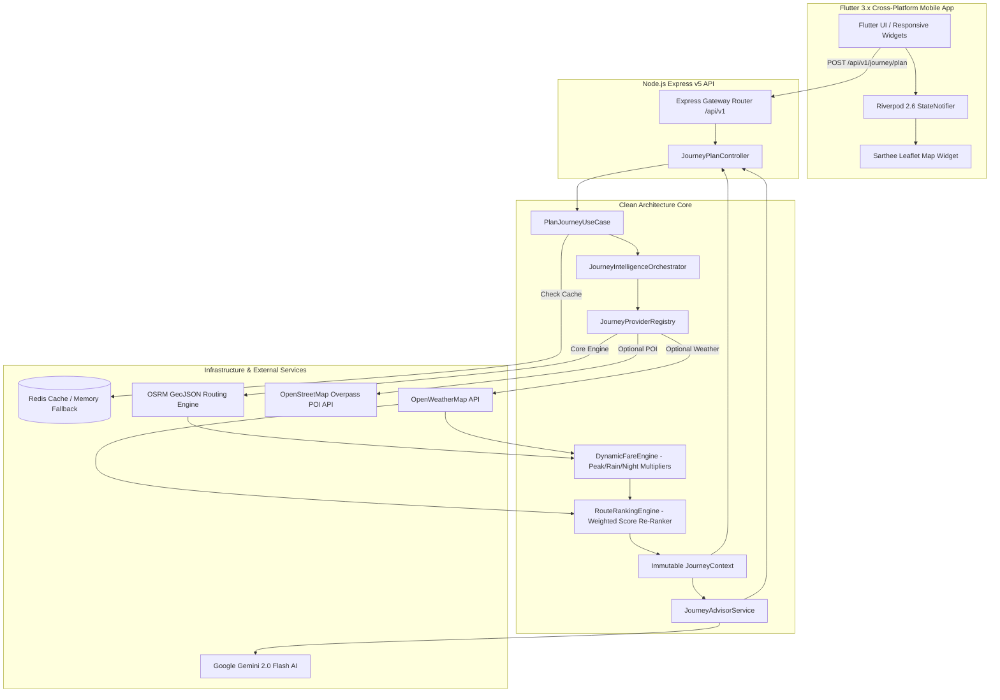
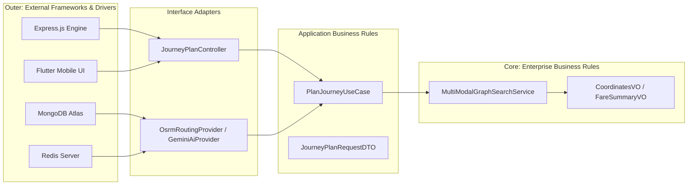
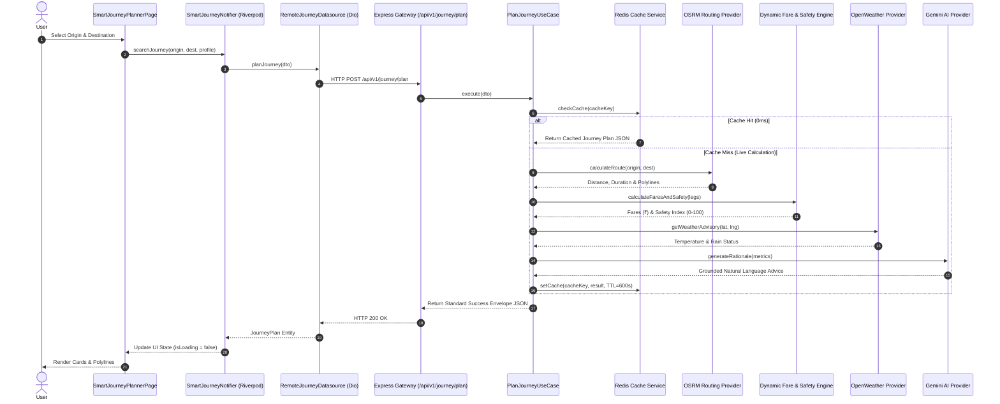
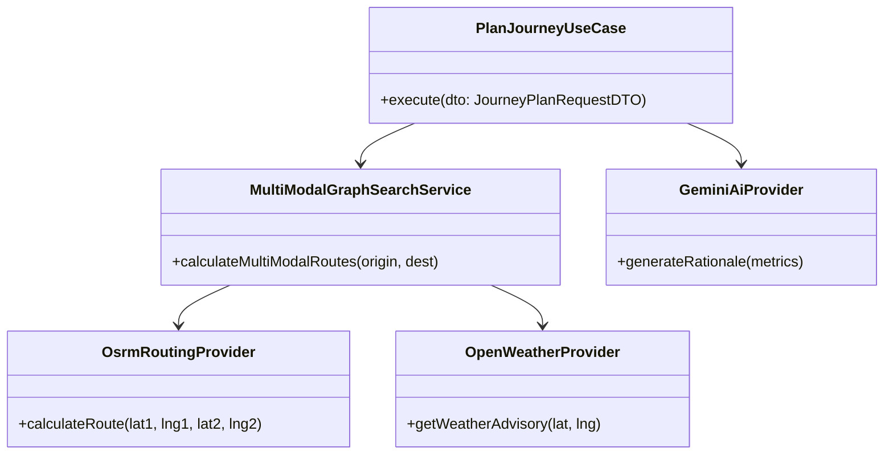

# 🏗️ Sarthee AI — System & Software Architecture

> Detailed architectural design, Clean Architecture layers, system interactions, and class relationships for Sarthee AI.

---

## 📌 1. High-Level System Architecture

---

## 📌 2. Clean Architecture Layer Breakdown

Sarthee AI adheres strictly to Clean Architecture principles:

---

## 📌 3. Request Lifecycle & Sequence Diagram

---

## 📌 4. Domain Class Relationships

---

## 📌 5. Phase 1 Dynamic Intelligence Engines & Active Guidance

### 5.1 DynamicFareEngine
Dedicated domain engine calculating time-of-day and weather surge multipliers:
- **Peak Hour Multiplier (`1.15x`)**: Active during morning (8–10 AM) and evening (5–8 PM) rush hours.
- **Rain Surge Multiplier (`1.25x`)**: Applied when monsoon rain/drizzle is reported.
- **Night Fare Multiplier (`1.25x`)**: Applied between 11 PM and 5 AM.

### 5.2 RouteRankingEngine & Weighted Scoring Formula
Calculates a composite recommendation score ($0 - 100$) for every candidate route profile:
$$\text{Score} = (\text{Time} \times 0.40) + (\text{Cost} \times 0.20) + (\text{Weather} \times 0.20) + (\text{Safety} \times 0.15) + (\text{Walking} \times 0.05)$$

- **Rain Re-Ranking**: Penalizes open walking (>250m) and open e-rickshaws, automatically promoting **Covered Metro Rail** as the top recommended route option.
- **Heat Re-Ranking**: Triggers when temperature $\ge 38^\circ\text{C}$, penalizing unshaded walking (>300m) and promoting AC transit.

### 5.3 Active Trip Guidance & Voice Suite
Flutter UI component (`ActiveTripGuidanceWidget.dart`) providing real-time trip execution state:
- Live leg progress bar (`LinearProgressIndicator`).
- Current step milestone details with OpenStreetMap landmark tips.
- Spoken turn-by-turn navigation via `VoiceGuidanceService.dart`.
- Next arrival milestone alerts and completion controls (`▶`).

---

## 📌 6. Phase 2B & 2C Live Transit, Traffic & Incident Intelligence

### 6.1 Generic Transit Abstraction & Trustworthy Fallback (`ITransitProvider`)
- Implements generic provider pattern (`GtfsRealtimeProvider`, `GtfsStaticProvider`) driven by `TRANSIT_PROVIDER` system configuration.
- **Rule — "Never Fake Real-Time"**: When live GTFS feeds are offline or unconfigured (`UNCONFIGURED`), transparently displays scheduled timetable metadata (`status: "SCHEDULED"`, `confidence: 0.7`) instead of faking fake countdown ETAs.

### 6.2 Traffic & Incident Intelligence (`TrafficProvider` & `IncidentProvider`)
- **Traffic Feed Monitor (`TrafficFeedMonitor.js`)**: Tracks feed health states (`UNCONFIGURED`, `HEALTHY`, `OFFLINE`).
- **Verified Congestion Penalties (`RouteRankingEngine.js`)**: Heavy road congestion (`+12 min delay`) or road closures (`ROAD_CLOSED`) automatically apply score penalties to cab/auto routes, promoting **Metro Rail** as the #1 recommended plan.
- **Flutter UI**: Displays `🟢 LIVE` or `🔵 SCHEDULED` badges, `🚦 Traffic` status chips, and `🚧 Incident` warning banners.
