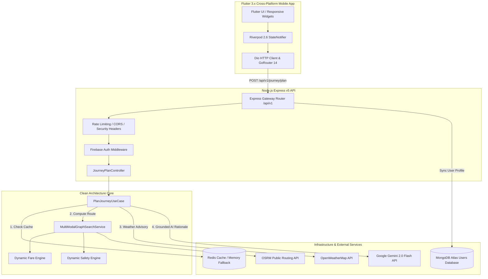
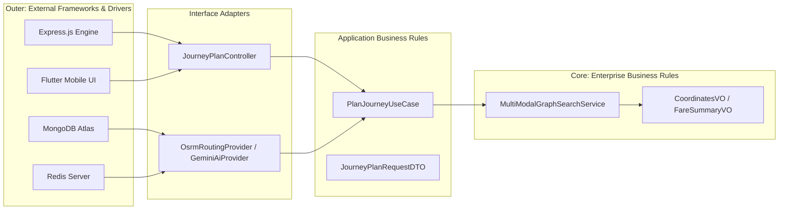
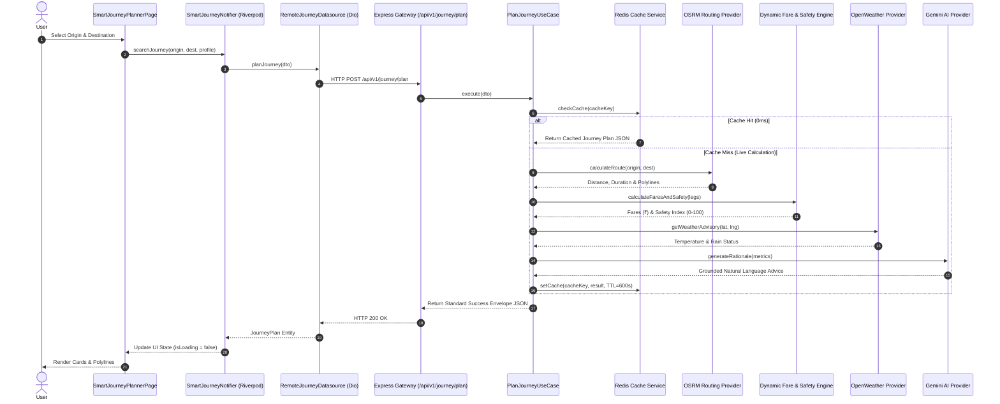
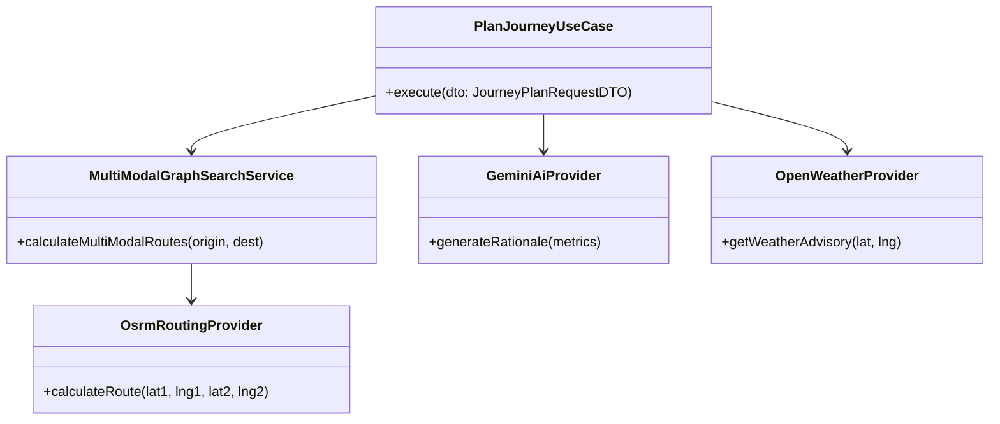

# 🏗️ Sarthee AI — System & Software Architecture

> Detailed architectural design, Clean Architecture layers, system interactions, and class relationships for Sarthee AI.

---

## 📌 1. High-Level System Architecture

---

## 📌 2. Clean Architecture Layer Breakdown

Sarthee AI adheres strictly to Clean Architecture principles:

---

## 📌 3. Request Lifecycle & Sequence Diagram

---

## 📌 4. Domain Class Relationships

