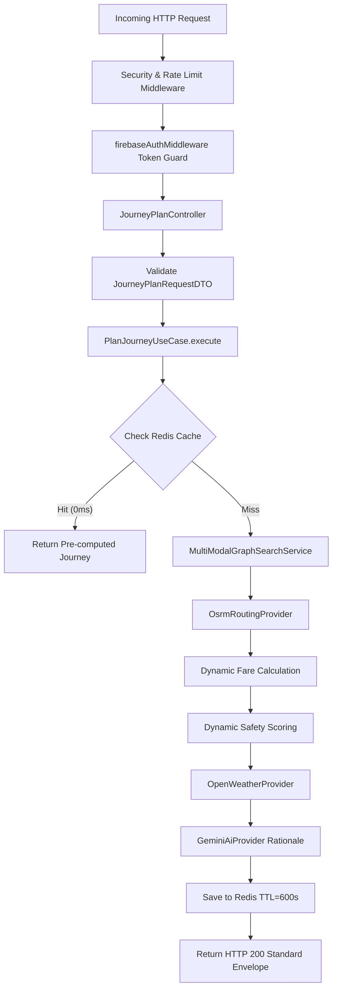

# 🖥️ Sarthee AI — Backend Architecture & Service Guide

> Deep-dive guide for the Node.js Express v5 REST API gateway (`backend/src/`), 5-layer Clean Architecture, Dynamic Calculation Engines, and Provider integrations.

---

## 📌 1. Tech Stack & Environment

- **Runtime**: Node.js (>=20.0.0, ESM Modules)
- **Framework**: Express.js (v5.2)
- **Database**: MongoDB Atlas via Mongoose (v9.8)
- **Cache Engine**: Redis Cloud (10-min TTL) with in-memory Map fallback
- **Authentication**: Firebase Admin SDK
- **Logging**: Pino structured JSON logger (`pino-pretty`)

---

## 📌 2. Directory Structure (`backend/src/`)

```text
backend/src/
├── api/                        # Central API Gateway & Versioned Route Definitions
│   └── v1/
│       └── routes/             # API V1 Router Registry (index.js, auth, journey, home)
├── app.js                      # Express v5 setup, middleware pipeline & error handlers
├── server.js                   # HTTP Server listener, port binding & startup validation
├── common/                     # Cross-cutting middleware & shared utilities
│   └── middleware/             # Rate limiter, CORS, Helmet security, envelope middleware
├── config/                     # Environment schema validation (env.js) & feature flags
├── core/                       # AppError definitions & Pino structured logger
├── database/                   # MongoDB connection lifecycle (mongoose.js)
├── infrastructure/             # External service adapters & concrete provider implementations
│   ├── cache/                  # RedisCacheService with in-memory Map fallback
│   ├── config/                 # Fare rules (metro.json, auto.json) & safety weights
│   └── providers/              # External API clients (OSRM, OpenWeather, Gemini 2.0 Flash)
├── middleware/                 # Firebase Auth & identity verification middleware
└── modules/                    # Clean Architecture Domain Modules
    ├── auth/                   # User authentication, user.model.js & profile controller
    ├── home/                   # Dashboard aggregation metrics & quick advisories
    └── journey/                # Core Multi-Modal Journey Engine
        ├── application/        # PlanJourneyUseCase, JourneyPlanRequestDTO
        ├── domain/             # MultiModalGraphSearchService, Fare & Safety Engines
        └── presentation/       # JourneyPlanController & route definitions
```

---

## 📌 3. Deterministic Calculation Engines

Unlike systems relying on AI to guess routes, Sarthee AI calculates all travel metrics 100% deterministically:

### 1. Dynamic Fare Engine
- **Files**: `backend/src/infrastructure/config/fare_rules/metro.json` & `auto.json`
- **Logic**: Evaluates distance meters from OSRM against DMRC distance slabs (e.g., 21–32km = ₹50) + auto-rickshaw rates (₹30 first km + ₹15/km).

### 2. Dynamic Safety Engine
- **File**: `backend/src/infrastructure/config/safety/weights.json`
- **Logic**: Evaluates time of day, lighting, transit mode risk (walking vs metro), and crowd density matrix to calculate a composite 0–100 safety score.

### 3. Grounded Gemini AI Provider
- **File**: `backend/src/infrastructure/providers/ai/gemini_ai_provider.js`
- **Logic**: Prompts Google Gemini 2.0 Flash to synthesize pre-computed metrics into natural language advice without metric hallucination.

---

## 📌 4. API Request Execution Pipeline



---

## 📌 5. Production Cloud Deployment (Render Platform)

- **Hosting Platform**: Render Cloud Platform (`https://sarthee-ai.onrender.com`).
- **Database**: MongoDB Atlas Managed Cluster (`mongodb+srv://...`).
- **Caching**: Redis Cloud Instance (`redis://...`) with memory fallback.
- **Health Check Probe**: `GET /` (`HTTP 200 OK`).

