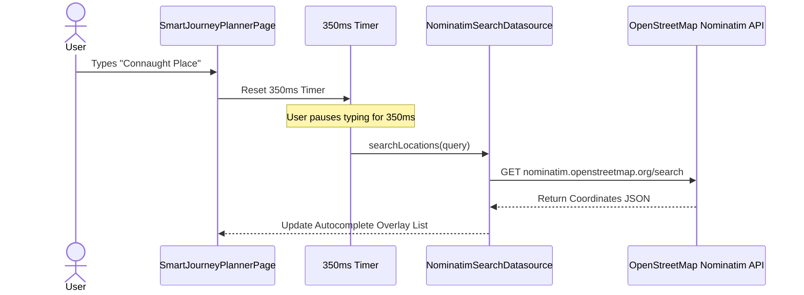

# 📱 Sarthee AI — Flutter Mobile App Architecture & Development Guide

> Comprehensive guide for the Flutter cross-platform mobile application (`Sarthe_AI/lib/`), Riverpod state management, GoRouter navigation, and feature-first Clean Architecture.

---

## 📌 1. Tech Stack Overview

- **Flutter SDK**: Dart 3.x / Flutter 3.x
- **State Management**: Riverpod 2.6 (`StateNotifierProvider`)
- **Navigation**: GoRouter 14.x (`StatefulShellRoute.indexedStack`)
- **HTTP Network Client**: Dio with global interceptors & token refresh
- **Local Persistence**: `FlutterSecureStorage` & Hive database
- **Location & Maps**: Geolocator, OpenStreetMap Nominatim, Polyline Decoder

---

## 📌 2. Directory Tree (`Sarthe_AI/lib/`)

```text
Sarthe_AI/lib/
├── app/                        # Application root configuration & bootstrap
│   ├── app.dart                # SartheeApp root widget (MaterialApp.router, Theme mode)
│   ├── bootstrap/              # App initialization (Firebase, Hive, Riverpod observers)
│   └── router/                 # GoRouter navigation rules
│       ├── app_router.dart     # StatefulShellRoute & screen route builders
│       ├── route_guards.dart   # Navigation guards (Auth check, Splash redirect)
│       ├── route_names.dart    # Named constants for routes
│       └── route_paths.dart    # Path string constants
├── config/                     # Environment configuration constants
├── core/                       # Shared core infrastructure
│   ├── api/                    # Core API client interfaces
│   ├── auth/                   # Core token manager & auth wrappers
│   ├── error/                  # Domain exceptions (LocationException, NetworkException)
│   ├── network/                # Dio client with Interceptors (api_client.dart)
│   ├── storage/                # Secure storage wrapper (secure_storage.dart)
│   └── theme/                  # Sarthee Design System (colors, spacing, typography, light/dark themes)
├── shared/                     # Reusable widgets & adaptive shell navigation
│   ├── models/                 # Common domain entities (UserVO, LocationVO)
│   ├── navigation/             # AppShell, bottom nav bar, navigation rail
│   └── widgets/                # Reusable buttons, text fields, cards, shimmer loaders
└── features/                   # Feature-First Modular Business Packages
    ├── smart_journey/          # Core Multi-Modal Journey Engine (UI, Notifier, Datasource)
    ├── auth/                   # Auth UI, Firebase Auth & Google Sign-In
    ├── profile/                # Profile view, edit dialog, preferences
    ├── location/               # GPS location service & permissions
    ├── home/                   # Dashboard homepage & weather summary
    └── weather/                # Standalone weather forecast cards
```

---

## 📌 3. State Management (Riverpod 2.6)

Sarthee AI uses Riverpod's `StateNotifierProvider` pattern for immutable state updates:

```dart
final smartJourneyProvider = StateNotifierProvider<SmartJourneyNotifier, SmartJourneyState>((ref) {
  final repository = ref.watch(journeyRepositoryProvider);
  return SmartJourneyNotifier(repository);
});
```

### Core Providers:
1. `smartJourneyProvider`: Manages `SmartJourneyState` (`isLoading`, `plans`, `selectedProfile`, `errorMessage`).
2. `authProvider`: Manages identity session, Firebase JWT tokens, and login states.
3. `profileProvider`: Manages user profile data and theme/language preferences.

---

## 📌 4. GoRouter 14.x Navigation

The application uses `GoRouter` with an adaptive `StatefulShellRoute` for tabbed navigation:

- `/splash`: Initial authentication & startup check screen.
- `/auth/login`: Google Sign-In & Email login screen.
- `/home`: Dashboard screen with quick transit actions.
- `/smart-journey`: Primary multi-modal route planner page.
- `/profile`: User settings & preferences editor.

---

## 📌 5. Debounced Place Autocomplete

Location search uses a 350ms debouncer to avoid overwhelming the Nominatim API:


