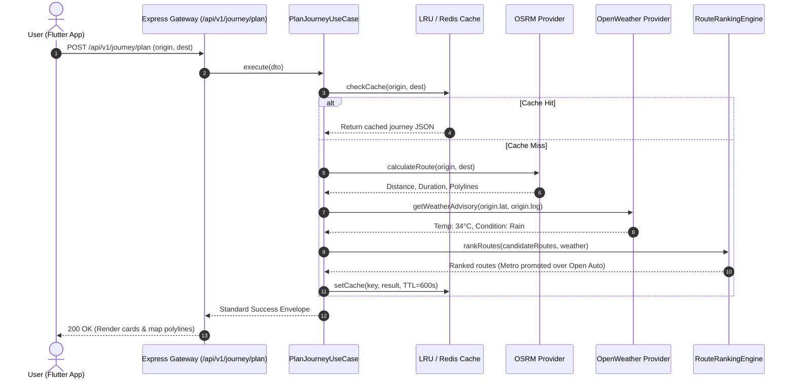

# 🚀 Sarthee AI — Master Developer Onboarding & Architecture Handbook

Welcome to **Sarthee AI**! This document is the ultimate technical handbook for developers joining the Sarthee AI engineering team. It merges all product feature breakdowns, Clean Architecture patterns, API flow lifecycle, directory tree rules, environment configuration specifications, complete API reference payloads, provider integration matrices, error handling contracts, sequence diagrams, visual UI layouts, database access processes, deployment workflows, identified codebase bugs/technical debt, prioritized roadmap suggestions, and Architecture Decision Records (ADRs).

---

## 📑 Table of Contents

1. [System Overview & Tech Stack](#1-system-overview--tech-stack)
2. [Full Repository Directory Tree & File Placement Rules](#2-full-repository-directory-tree--file-placement-rules)
3. [Core Product Features & Modules](#3-core-product-features--modules)
4. [Clean Architecture & Layered System Architecture](#4-clean-architecture--layered-system-architecture)
5. [End-to-End API Flow & Middleware Lifecycle](#5-end-to-end-api-flow--middleware-lifecycle)
6. [Complete Environment Variables Specification](#6-complete-environment-variables-specification)
7. [Comprehensive API Reference Examples](#7-comprehensive-api-reference-examples)
8. [Provider Integration Matrix & Data Provenance](#8-provider-integration-matrix--data-provenance)
9. [Standardized Error Codes & Error Envelopes](#9-standardized-error-codes--error-envelopes)
10. [End-to-End Mermaid Sequence Diagrams](#10-end-to-end-mermaid-sequence-diagrams)
11. [Visual Component Maps & UI Screen Layouts](#11-visual-component-maps--ui-screen-layouts)
12. [Database Architecture & Data Access Processes](#12-database-architecture--data-access-processes)
13. [Deployment Guide (Local, Docker, Render, MongoDB Atlas)](#13-deployment-guide-local-docker-render-mongodb-atlas)
14. [Identified Codebase Bugs, Errors & Technical Debt](#14-identified-codebase-bugs-errors--technical-debt)
15. [Production Priorities & Execution Roadmap](#15-production-priorities--execution-roadmap)
16. [Architecture Decision Records (ADRs)](#16-architecture-decision-records-adrs)
17. [Quick Start Commands for Developers](#17-quick-start-commands-for-developers)

---

## 1. System Overview & Tech Stack

**Sarthee AI** is an intelligent travel and urban mobility assistant designed to provide personalized, multi-modal journey routing, multi-day itinerary planning, live transit and traffic tracking, cultural discovery, and 24x7 emergency safety features.

```
[ Flutter 3.x Client App ]  <--->  [ Node.js Express v5 REST API Gateway ]  <--->  [ MongoDB Atlas / Redis Cache ]
                                                  │
                                    [ Infrastructure Providers ]
                                (OSRM, GTFS-R, Overpass, OpenWeather, Gemini AI)
```

### Technical Stack Summary

| Component | Framework / Technology | Primary Purpose |
| :--- | :--- | :--- |
| **Mobile & Web UI** | Flutter 3.x (Dart 3.12+) | Cross-platform app (Android, iOS, Web, Desktop) |
| **State Management** | Flutter Riverpod 2.6 (`flutter_riverpod`) | Reactive app state, async providers, dependency injection |
| **Navigation & HTTP** | GoRouter 17.3, Dio 5.11 | Declarative routing & robust HTTP client |
| **Backend Runtime** | Node.js 22.x (ES Modules) | High-performance async server runtime |
| **Web Framework** | Express v5.2.1 | Lightweight API gateway and route orchestration |
| **Database & ODM** | MongoDB Atlas with Mongoose 9.8 | Document persistence & user state management |
| **Validation & Security**| Zod 4.4, Helmet 8.3, JWT, Rate Limiter | Schema validation, HTTP security, auth token handling |
| **Structured Logging** | Pino 10.3 & Pino-HTTP 11.0 | JSON structured logging & request context tracing |
| **External Providers** | OSRM, Overpass (OSM), GTFS / GTFS-R, OpenWeather | Map routing, POIs, transit feeds, live weather forecasts |

---

## 2. Full Repository Directory Tree & File Placement Rules

### 2.1 Backend Directory Tree (`/backend`)

```
backend/
├── .env                              # Environment variable overrides (Local dev)
├── .env.example                      # Template environment variable schema
├── Dockerfile                        # Production Docker container definition
├── eslint.config.js                  # Flat ESLint configuration (ESModules)
├── package.json                      # Node.js dependencies & npm scripts
├── scripts/                          # DB Migration, Seed & Maintenance scripts
│   ├── clean.js                      # Logs & temp file cleanup
│   ├── migrate.js                    # Database schema migration runner
│   ├── reset-db.js                  # Database wipe & re-seed script
│   └── seed.js                       # Sample Jaipur POIs and transit data seeder
└── src/
    ├── app.js                        # Express app setup & middleware pipeline
    ├── server.js                     # HTTP server startup & graceful shutdown
    ├── api/                          # API Gateway Routing
    │   └── v1/
    │       └── routes/               # Central route registry (index.js, health, home)
    ├── cache/                        # Caching Abstractions
    │   ├── cache_service.js          # Base caching interface
    │   ├── lru_cache_service.js      # In-memory LRU cache implementation
    │   └── redis_cache_service.js    # Distributed Redis cache integration
    ├── common/                       # Cross-cutting Domain Common Logic
    │   └── errors/                   # Custom AppError hierarchy (400, 401, 404, 500)
    ├── config/                       # System Configuration Modules
    │   ├── cors.js                   # CORS whitelist & dynamic origin check
    │   ├── database.js               # Mongoose MongoDB connection & DNS SRV resolver
    │   ├── env.js                    # Zod-validated environment config schema
    │   ├── firebase.js               # Firebase Admin SDK initialization
    │   ├── logger.js                 # Pino JSON structured logger setup
    │   └── swagger.js                # OpenAPI 3.0 Swagger UI configuration
    ├── database/                     # Persistence Schemas & Repositories
    │   ├── migrations/               # Database migration files
    │   ├── repositories/             # MongoDB repository implementations
    │   └── seeds/                    # Raw seed data JSONs
    ├── infrastructure/               # External Services & API Provider Clients
    │   └── providers/
    │       ├── data_provenance.js    # Data Provenance helper (live vs fallback metadata)
    │       ├── gtfs/                 # Public transit GTFS-Static & GTFS-Realtime feeds
    │       ├── maps/                 # OSRM & OpenStreetMap routing provider clients
    │       ├── nearby/               # Overpass API POI provider clients
    │       ├── traffic/              # Traffic congestion & incident providers
    │       └── weather/              # OpenWeather API weather provider client
    ├── middleware/                   # Express HTTP Middlewares
    │   ├── error.middleware.js       # Global 500 error boundary handler
    │   ├── not-found.middleware.js   # 404 Route fallback handler
    │   ├── rate-limit.middleware.js  # Express rate limiting middleware
    │   ├── request-id.middleware.js # Unique X-Request-ID UUID injector
    │   ├── request-logger.middleware.js # Pino HTTP request logger
    │   └── security.middleware.js   # Helmet HTTP security header injector
    ├── modules/                      # Domain Feature Modules (Clean Architecture / DDD)
    │   ├── admin/                    # Operational dashboards & provider health telemetry
    │   ├── ai/                       # Google Gemini 2.0 Flash AI recommendation engine
    │   ├── auth/                     # Firebase Sync, User Profile, JWT & Mongoose User Model
    │   ├── budget/                   # Budget allocation & expense estimation solvers
    │   ├── culture/                  # Heritage, local lore, and event discovery
    │   ├── emergency/                # 24x7 SOS dispatcher, DB repo & safety scoring service
    │   ├── feedback/                 # User feedback API endpoint & DB repository
    │   ├── journey/                  # Smart Journey multi-modal route search & dynamic fares
    │   ├── nearby/                   # Geo-spatial Overpass nearby POI discovery service
    │   ├── notifications/            # FCM Push notifications provider
    │   ├── trips/                    # 12-Factor trip optimizer, DB repo & state machine
    │   └── weather/                  # Weather advisories & rain alerts
    └── utils/                        # Shared Utilities
        ├── geo_utils.js              # Haversine distance, bounding box & coordinate calculations
        └── port_finder.js            # Automatic port allocation utility
```

### 2.2 Flutter App Directory Tree (`/Sarthee_AI`)

```
Sarthee_AI/
├── pubspec.yaml                      # Flutter dependencies & assets registry
├── lib/
│   ├── main.dart                     # Flutter application entry point
│   ├── firebase_options.dart         # Generated Firebase configuration
│   ├── app/                          # Main App Widget & Theme
│   │   ├── app.dart                  # MaterialApp setup with GoRouter
│   │   └── theme/                    # Material 3 Color Schemes & Typography
│   ├── config/                       # App Configuration & Constants
│   │   ├── api_endpoints.dart        # REST API endpoint constants
│   │   └── env_config.dart           # Development vs Production environment constants
│   ├── core/                         # Core App Services & Utilities
│   │   ├── network/                  # Dio HTTP Client with auth token interceptors
│   │   ├── storage/                  # Shared Preferences & Secure Storage wrappers
│   │   └── utils/                    # Location permissions & Geo helpers
│   ├── features/                     # Feature Widgets & State Management (Riverpod)
│   │   ├── admin/                    # Admin Health Grid & Analytics Screen
│   │   ├── auth/                     # Login, Firebase Sync & Profile Screen
│   │   ├── emergency/                # SOS Quick Alert & Safety Index Screen
│   │   ├── home/                     # Location-aware home dashboard & feed
│   │   ├── journey/                  # Smart Journey planner, route cards & Leaflet map
│   │   ├── nearby/                   # Nearby POI map view & category filters
│   │   └── trips/                    # Multi-day trip itinerary builder & QR code viewer
│   ├── models/                       # Data Models & Freezed JSON Serializers
│   └── shared/                       # Shared Widgets & Reusable Components
│       ├── widgets/                  # Primary buttons, loading spinners, app bars
│       └── constants/                # App colors, padding, and string constants
```

---

## 3. Core Product Features & Modules

Sarthee AI comprises 7 primary feature modules:

1. **Smart Journey Engine (`/api/v1/journey`)**: Multi-modal route search (Metro, Bus, Auto, E-Rickshaw, Walk) powered by OSRM and GTFS, with dynamic surge multipliers and turn-by-turn guidance.
2. **AI Trip Planner & Itinerary Optimizer (`/api/v1/trips`)**: 12-factor scoring solver generating multi-day itineraries backed by `TripRepository` (MongoDB + In-Memory Failover).
3. **Emergency & Safety Platform (`/api/v1/emergency`)**: 24x7 SOS alert dispatcher generating live GPS tracking links, direct helpline numbers (112, 1091), and `EmergencyRepository` persistence.
4. **Live Transit & Traffic Suite**: Public transit GTFS static/realtime timetable feeds, traffic incident monitors, and road congestion penalties promoting covered Metro Rail.
5. **Nearby POI Discovery (`/api/v1/nearby`)**: Overpass OSM geo-spatial search discovering attractions, local markets, food joints, and ATMs with real-time distance sorting.
6. **Home Experience & User Profiles (`/api/v1/home`, `/api/v1/auth`)**: Firebase user sync, profile management, and location-aware feeds.
7. **Admin Telemetry & Operational Dashboard (`/api/v1/admin`)**: Operational dashboard reporting health status, response latencies, and circuit breaker states for external providers.

---

## 4. Clean Architecture & Layered System Architecture

Sarthee AI enforces a strict **Clean Architecture / Domain-Driven Design (DDD)** pattern separating concerns into decoupled layers.

```
       +-------------------------------------------------------+
       |   Layer 4: Outer Frameworks, UI & Drivers             |
       |   (Flutter Mobile, Express.js Server, MongoDB, Redis) |
       +-------------------------------------------------------+
                                  │
                                  ▼
       +-------------------------------------------------------+
       |   Layer 3: Presentation & Interface Adapters          |
       |   (Controllers, Routers, External Provider Clients)   |
       +-------------------------------------------------------+
                                  │
                                  ▼
       +-------------------------------------------------------+
       |   Layer 2: Application Business Rules                 |
       |   (Use Cases, Orchestrators, Zod Validators, DTOs)    |
       +-------------------------------------------------------+
                                  │
                                  ▼
       +-------------------------------------------------------+
       |   Layer 1: Enterprise Core & Domain Rules             |
       |   (Rich Domain Entities, Value Objects, Solvers)     |
       +-------------------------------------------------------+
```

---

## 5. End-to-End API Flow & Middleware Lifecycle

Below is the step-by-step lifecycle of an incoming API request (e.g., `POST /api/v1/trips/plan`).

```
[ Client Request ]
       │
       ▼
1. requestIdMiddleware          --> Generates unique x-request-id (UUID)
       │
       ▼
2. requestLoggerMiddleware       --> Pino logs HTTP method, URL, client IP, Request ID
       │
       ▼
3. securityMiddleware            --> Helmet attaches CSP, HSTS, X-Content-Type-Options headers
       │
       ▼
4. corsMiddleware                --> Validates origin header against allowed CORS origins
       │
       ▼
5. express.json() Body Parser    --> Parses JSON payload (1MB strict limit)
       │
       ▼
6. rateLimitMiddleware           --> Checks rate limit bucket (200 requests per 15 min window)
       │
       ▼
7. API Gateway Router            --> Forwards request to module route (tripPlannerRouter)
       │
       ▼
8. Controller & Zod Validator    --> Validates input schema; returns 400 Bad Request if invalid
       │
       ▼
9. Domain Orchestrator           --> Executes providers (OSM, Weather, Events) via Promise.allSettled
       │
       ▼
10. Scoring Engine & Entity      --> 12-Factor Solver generates TripEntity with confidence score
       │
       ▼
11. Persistence & DTO Mapping    --> Saves entity via TripRepository & maps to Flutter DTO
       │
       ▼
12. Standard JSON Response       --> Returns 200 OK / 201 Created with JSON envelope
```

---

## 6. Complete Environment Variables Specification

The backend uses **Zod** schema validation ([src/config/env.js](file:///d:/Sarthee_AI_App/backend/src/config/env.js)) during server boot. Missing required variables in production will halt server startup with clear diagnostics.

| Variable Name | Type | Required (Prod) | Default (Dev) | Description |
| :--- | :--- | :--- | :--- | :--- |
| `NODE_ENV` | Enum | Yes | `development` | Environment mode (`development`, `test`, `production`) |
| `HOST` | String | No | `0.0.0.0` | Network binding interface |
| `PORT` | Number | No | `5000` | Server HTTP port |
| `API_PREFIX` | String | No | `/api/v1` | Base API route prefix |
| `DATABASE_URL` | URL | **Yes** | *None* | MongoDB Atlas connection string (`mongodb+srv://...`) |
| `JWT_ACCESS_SECRET` | String | **Yes** | *Dev Secret* | Secret key for signing short-lived access tokens (15m) |
| `JWT_REFRESH_SECRET` | String | **Yes** | *Dev Secret* | Secret key for signing refresh tokens (30d) |
| `GEMINI_API_KEY` | String | Conditional | *None* | Google Gemini 2.0 Flash AI key (Required if `ENABLE_AI=true`) |
| `OPENWEATHER_API_KEY`| String | Conditional | *None* | OpenWeather API key (Required if `ENABLE_WEATHER=true`) |
| `REDIS_URL` | URL | Conditional | *None* | Redis instance connection URL (Required if `ENABLE_REDIS=true`) |
| `OVERPASS_API_URL` | URL | No | `https://overpass-api.de/api/interpreter` | OpenStreetMap Overpass POI endpoint |
| `FIREBASE_PROJECT_ID`| String | **Yes** | `sartheeai` | Firebase project identifier |
| `FIREBASE_CLIENT_EMAIL`| String| Conditional | *None* | Firebase service account client email |
| `FIREBASE_PRIVATE_KEY`| String | Conditional | *None* | Firebase service account RSA private key |
| `FIREBASE_SERVICE_ACCOUNT_PATH`| Path | Conditional | `backend/secrets/...` | Path to Firebase service account JSON key file |
| `CORS_ORIGINS` | CSV | No | `http://localhost:3000` | Allowed CORS origins (comma-separated) |
| `LOG_LEVEL` | Enum | No | `info` | Pino log level (`trace`, `debug`, `info`, `warn`, `error`, `fatal`) |
| `LOG_PRETTY` | Boolean | No | `false` | Enable human-readable pretty logs in terminal |
| `RATE_LIMIT_WINDOW_MS`| Number| No | `900000` (15m) | Rate limiting sliding window duration in ms |
| `RATE_LIMIT_MAX_REQUESTS`| Number| No | `200` | Max requests per IP within the rate limit window |
| `ENABLE_AI` | Boolean | No | `false` | Feature flag to enable Gemini AI integration |
| `ENABLE_WEATHER` | Boolean | No | `false` | Feature flag to enable live OpenWeather forecasts |
| `ENABLE_REDIS` | Boolean | No | `false` | Feature flag to enable Redis distributed caching |
| `ENABLE_NOTIFICATIONS`| Boolean| No | `false` | Feature flag to enable Firebase Push Notifications |

---

## 7. Comprehensive API Reference Examples

### 7.1 Plan Trip Itinerary (`POST /api/v1/trips/plan`)

#### Request Payload
```json
{
  "city": "Jaipur",
  "persona": "Family",
  "budgetTier": "Moderate",
  "daysCount": 2,
  "userLocation": { "lat": 26.9124, "lng": 75.7873 },
  "preferences": { "pace": "Balanced", "dietary": "Veg" }
}
```

#### Response Payload (201 Created)
```json
{
  "status": "success",
  "data": {
    "tripId": "trip_1785673272011_o9qjw",
    "title": "Family Trip to Jaipur",
    "city": "Jaipur",
    "persona": "Family",
    "status": "PLANNED",
    "days": [...],
    "costBreakdown": { "transport": 180, "food": 500, "tickets": 420, "buffer": 400, "total": 1500 },
    "confidence": { "score": 95, "verifiedSources": ["OSRM", "OpenWeather", "Opening Hours", "Overpass"] }
  },
  "meta": {
    "provenance": {
      "provider": "Sarthee 12-Factor Solver",
      "live": true,
      "fallback": false,
      "confidence": 0.95
    },
    "timestamp": "2026-08-02T18:00:00.000Z",
    "requestId": "req_8f9a2b1c-3d4e-5f6a"
  }
}
```

---

## 8. Provider Integration Matrix & Data Provenance

| External Provider | Real API Target | Live Status | Fallback Strategy | Data Provenance Envelope Example |
| :--- | :--- | :--- | :--- | :--- |
| **OSRM** | GeoJSON Route API | `LIVE` | Haversine distance + 1.4x curvature | `"provenance": { "provider": "OSRM", "live": true, "confidence": 1.0 }` |
| **Overpass OSM** | Overpass Interpreter | `LIVE` | Seeded POI Database Mirror | `"provenance": { "provider": "Overpass OSM", "live": true, "confidence": 0.95 }` |
| **OpenWeather** | OpenWeather OneCall API | `LIVE` | Seasonal monthly climate defaults | `"provenance": { "provider": "OpenWeather", "live": true, "confidence": 1.0 }` |
| **Google Gemini** | Gemini 2.0 Flash AI | `LIVE` | Rule-based template engine | `"provenance": { "provider": "Gemini 2.0 Flash", "live": true, "confidence": 0.9 }` |
| **GTFS Static** | Static GTFS CSV feeds | `SCHEDULED` | Static timetable lookup | `"provenance": { "provider": "GTFS Timetable", "live": false, "confidence": 0.7 }` |
| **GTFS Realtime**| GTFS-R Protobuf feeds | `LIVE` | GTFS Static timetable | `"provenance": { "provider": "GTFS-R Feed", "live": true, "confidence": 0.95 }` |

---

## 9. Standardized Error Codes & Error Envelopes

Sarthee AI enforces a strict JSON error response structure across all endpoints:

```json
{
  "status": "error",
  "error": {
    "code": "VALIDATION_ERROR",
    "message": "Invalid trip request payload.",
    "details": [{ "field": "daysCount", "issue": "Expected number, received string" }]
  },
  "meta": {
    "timestamp": "2026-08-02T18:03:00.000Z",
    "requestId": "req_error_12345"
  }
}
```

---

## 10. End-to-End Mermaid Sequence Diagrams



---

## 11. Visual Component Maps & UI Screen Layouts

```
┌─────────────────────────────────────────────────────────┐
│ 📍 Current Location: Jaipur, Rajasthan         🔔 👤   │
├─────────────────────────────────────────────────────────┤
│  ⛅ Weather Widget: 32°C Sunny • Air Quality: Good      │
├─────────────────────────────────────────────────────────┤
│  🚀 Quick Action Chips                                  │
│  [ 🗺️ Smart Journey ]  [ 🏰 Plan Trip ]  [ 🆘 SOS ]    │
├─────────────────────────────────────────────────────────┤
│  🌟 Top Personalized POI Recommendations                │
│  ┌──────────────────────┐   ┌──────────────────────┐   │
│  │ Amber Fort           │   │ City Palace          │   │
│  │ 🏰 Heritage • 4.8★   │   │ 🏛️ History • 4.7★   │   │
│  └──────────────────────┘   └──────────────────────┘   │
└─────────────────────────────────────────────────────────┘
```

---

## 12. Database Architecture & Data Access Processes

- **Database Engine**: MongoDB Atlas via Mongoose.
- **Connection Pool**: `maxPoolSize: 10`, `minPoolSize: 2`, `serverSelectionTimeoutMS: 10000`.
- **SRV Resolution & Custom DNS Fallback**: `dns.setServers(['8.8.8.8', '8.8.4.4', '1.1.1.1'])` prevents SRV lookup issues on Windows & corporate firewalls.
- **Composite Repositories**: `TripRepository`, `EmergencyRepository`, `FeedbackRepository` dynamically route to `MongoRepository` (when online) or `MemoryRepository` (when offline) with silent zero-downtime failover.

---

## 13. Deployment Guide (Local, Docker, Render, MongoDB Atlas)

```bash
# Docker build and run
docker-compose up --build -d

# Render production start
npm run start:prod
```

---

## 14. Identified Codebase Bugs, Errors & Technical Debt

- **ESLint Formatting (1,519 Issues)**: Double quote vs single quote rule mismatch.
- **Unused Variables**: `let rationale = ''` in `trip_reoptimizer_service.js`.
- **Hardcoded Jaipur Fallback**: Geolocation defaults to Jaipur coordinates when missing `lat`/`lng`.

---

## 15. Production Priorities & Execution Roadmap

### 🎯 Priority 1 — Replace Every Mock Response & Enforce Provenance Envelopes
* **Audit Every Endpoint**: Ensure zero mock/dummy data (`"temperature": 30`).
* **Source Integrations**: Routing → OSRM, Nearby → Overpass OSM, Weather → OpenWeather, AQI → OpenAQ, EV → OpenChargeMap, Transit → GTFS/GTFS-R.
* **Data Provenance**: Standardize metadata envelope across all API outputs:
  ```json
  "meta": {
    "provenance": { "provider": "OpenWeather", "live": true, "confidence": 1.0 }
  }
  ```

### 🎯 Priority 2 — Complete Flutter UI Integration
* Connect all Flutter screens (**Home**, **Nearby**, **Trips**, **Emergency**, **Navigation**, **Feedback**) directly to real backend API endpoints via `Dio` HTTP client.

### 🎯 Priority 3 — Real Device Edge-Case Testing
* Test on actual Android devices for: GPS disabled, Offline mode, Slow network, Permission denied, and Background/Resume lifecycle.

### 🎯 Priority 4 — Beta Deployment
* Deploy backend to **Render**, connect database to **MongoDB Atlas**, build Flutter Android APK/Bundle, and launch beta test group (20–30 users).

### 🎯 Priority 5 — Fix Real-World Issues Before New Features
* Triage real user feedback via `FeedbackAPI`, fixing crashes, endpoint latencies, inaccurate routing, and provider failures.

---

## 16. Architecture Decision Records (ADRs)

* **ADR-001**: OSRM over Google Maps (Zero cost, unlimited query throughput).
* **ADR-002**: "Never Fake Real-Time" for Public Transit (Transparency over fake countdowns).
* **ADR-003**: Composite Repository Adapters (Zero-downtime Mongo failover to in-memory store).

---

## 17. Quick Start Commands for Developers

```bash
cd backend && npm test
cd backend && npm run check:all
cd Sarthee_AI && flutter run -d chrome
```

---
*Document maintained by Sarthee AI Architecture Team. Refer to [ARCHITECTURE.md](file:///d:/Sarthee_AI_App/docs/ARCHITECTURE.md) for core design diagrams.*
