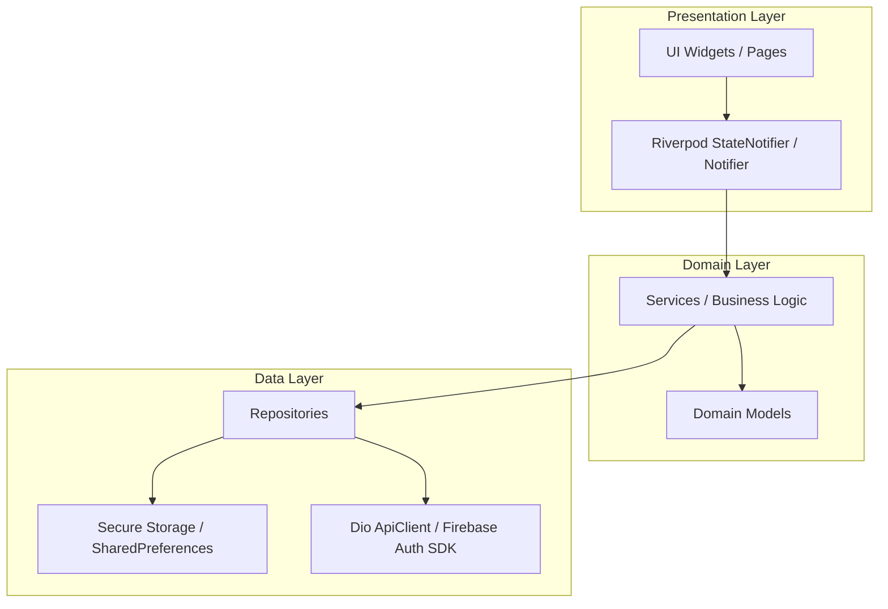

# Sarthe_AI — Flutter App Structure & Architecture Guide

This document presents the complete directory layout, architectural patterns, state management design, and component interaction flow of the **`Sarthe_AI`** Flutter application codebase.

---

## 1. Directory Tree & Folder Layout

```
Sarthe_AI/
├── android/                        # Android native project & Gradle build files
├── ios/                            # iOS native project & CocoaPods configuration
├── web/                            # Web entry point & index.html
├── windows/                        # Windows C++ desktop runner
├── macos/                          # macOS native desktop project
├── linux/                          # Linux GTK desktop runner
├── pubspec.yaml                    # Flutter dependencies, SDK versions, & assets config
├── firebase.json                   # Firebase project mapping
├── analysis_options.yaml           # Linter rules & static analysis configuration
└── lib/                            # Application Source Code Root
    ├── main.dart                   # Entry point: Firebase init, Zone error handling, ProviderScope
    ├── firebase_options.dart       # Auto-generated Firebase multi-platform credentials
    ├── app/                        # Root application widget & routing configuration
    │   ├── app.dart                # SartheeApp (MaterialApp.router, Theme mode, Router config)
    │   └── router/                 # Declarative GoRouter setup
    │       ├── app_router.dart     # StatefulShellRoute.indexedStack & route builders
    │       ├── route_guards.dart   # Guard logic (Auth check, Profile completion, Splash redirect)
    │       ├── route_names.dart    # Named constants for routes
    │       ├── route_paths.dart    # Path string constants
    │       └── route_observer.dart # Navigation analytics & observer
    ├── config/                     # Application configuration stubs
    │   └── firebase_config.dart
    ├── core/                       # Shared core infrastructure & design system
    │   ├── api/                    # Core API client interfaces
    │   ├── auth/                   # Token management (token_manager.dart)
    │   ├── error/                  # Domain exceptions (auth_exception.dart, location_exception.dart)
    │   ├── network/                # Dio client with Interceptors (api_client.dart)
    │   ├── storage/                # Secure storage wrapper (secure_storage.dart)
    │   └── theme/                  # Sarthee Design System
    │       ├── app_colors.dart     # Curated HSL/Hex color palettes
    │       ├── app_spacing.dart    # Grid constants & padding tokens
    │       ├── app_text_styles.dart# Typography definitions
    │       ├── app_theme.dart      # Light & Dark ThemeData builders
    │       └── theme_controller.dart# Riverpod Theme State Controller
    ├── shared/                     # Cross-feature widgets & navigation shell
    │   ├── models/                 # Global UI models
    │   ├── navigation/             # Adaptive Shell Navigation System
    │   │   ├── app_shell.dart      # Outer shell wrapping active tab content
    │   │   ├── app_bottom_nav.dart # Mobile bottom navigation bar
    │   │   ├── app_navigation_rail.dart # Tablet/Desktop navigation rail
    │   │   ├── responsive_navigation.dart # Screen-size break-point evaluator
    │   │   ├── navigation_config.dart # Primary tabs definition (Home, Explore, AI, Trips, Profile)
    │   │   └── navigation_controller.dart # Active index state notifier
    │   ├── services/               # Shared background services
    │   └── widgets/                # Common UI buttons, cards, dialogs, & loaders
    └── features/                   # Feature-First Modular Business Domains
        ├── auth/                   # [ACTIVE] Auth UI, Firebase Auth & Google Sign-In
        ├── profile/                # [ACTIVE] Profile view, Edit profile, Profile setup wizard
        ├── location/               # [ACTIVE] Geolocator service, GPS permission & location page
        ├── splash/                 # [ACTIVE] Splash loading & startup initialization
        ├── home/                   # [BASIC] Home feed shell
        ├── ai_chat/                # [PLANNED] AI Assistant ("Ask Sarthee") chat interface
        ├── destinations/           # [PLANNED] Explore places & local attractions
        ├── trip_planner/           # [PLANNED] Custom itinerary creation & management
        ├── culture/                # [PLANNED] Cultural heritage & stories
        ├── food/                   # [PLANNED] Local food discovery & dining recommendations
        ├── hotels/                 # [PLANNED] Stays & accommodation recommendations
        ├── budget/                 # [PLANNED] Expense tracking & trip budget manager
        ├── weather/                # [PLANNED] Real-time location weather forecast
        ├── safety/                 # [PLANNED] Emergency contacts & safety advisories
        ├── settings/               # [PLANNED] App preferences & notifications settings
        └── authentication/         # ⚠️ [DEPRECATED STUB] Duplicate empty clean-arch folder
```

---

## 2. System Architecture & Layering

The application adopts a **Feature-First Clean Architecture** with **Riverpod** state management:



### Core Architectural Components

1. **Root Bootstrapping ([`lib/main.dart`](file:///d:/Sarthee_AI_App/Sarthe_AI/lib/main.dart))**:
   - Encapsulates launch logic inside `runZonedGuarded` to capture unhandled async errors.
   - Initializes Firebase Core via [`firebase_options.dart`](file:///d:/Sarthee_AI_App/Sarthe_AI/lib/firebase_options.dart).
   - Initializes [`AuthService`](file:///d:/Sarthee_AI_App/Sarthe_AI/lib/features/auth/auth_service.dart) singleton.
   - Loads `SharedPreferences` asynchronously and overrides `sharedPreferencesProvider` in Riverpod `ProviderScope`.

2. **Declarative Navigation & Shell Routing ([`lib/app/router/app_router.dart`](file:///d:/Sarthee_AI_App/Sarthe_AI/lib/app/router/app_router.dart))**:
   - Built on top of **GoRouter**.
   - Uses `StatefulShellRoute.indexedStack` to maintain **5 distinct branch navigators** (`home`, `explore`, `ai`, `trips`, `profile`).
   - Retains scroll state, user input, and navigation history per tab when switching.
   - Implements **Adaptive Page Transitions** (`CustomTransitionPage` combining `FadeTransition` and `SlideTransition`).
   - Employs **Global Route Guards** ([`route_guards.dart`](file:///d:/Sarthee_AI_App/Sarthe_AI/lib/app/router/route_guards.dart)) that automatically evaluate authentication state, profile completion ratio, and bootstrap phase to handle secure redirects.

3. **Responsive Navigation Shell ([`lib/shared/navigation/`](file:///d:/Sarthee_AI_App/Sarthe_AI/lib/shared/navigation))**:
   - `ResponsiveNavigation` dynamically inspects screen width.
   - Renders `AppBottomNav` on Mobile devices (<600px).
   - Renders `AppNavigationRail` or `AppNavigationDrawer` on Tablet/Desktop devices (>=600px).

4. **Network & API Interceptors ([`lib/core/network/api_client.dart`](file:///d:/Sarthee_AI_App/Sarthe_AI/lib/core/network/api_client.dart))**:
   - Uses **Dio** with pre-configured timeouts (15 seconds).
   - Interceptor automatically injects `Authorization: Bearer <token>` fetched from [`SecureStorage`](file:///d:/Sarthee_AI_App/Sarthe_AI/lib/core/storage/secure_storage.dart).
   - Provides structured debug logging for HTTP requests, response statuses, and payloads.

---

## 3. Active Modules vs. Planned Features Breakdown

| Module | Location | Description & Implementation Status |
| :--- | :--- | :--- |
| **Auth** | [`lib/features/auth`](file:///d:/Sarthee_AI_App/Sarthe_AI/lib/features/auth) | **Full Implementation**: Login, Signup, Firebase Auth, Google Sign-In, token synchronization via `AuthSyncService`. |
| **Profile** | [`lib/features/profile`](file:///d:/Sarthee_AI_App/Sarthe_AI/lib/features/profile) | **Full Implementation**: Profile overview, profile edit form, multi-step profile setup wizard (`ProfileSetupPage`). |
| **Location** | [`lib/features/location`](file:///d:/Sarthee_AI_App/Sarthe_AI/lib/features/location) | **Full Implementation**: GPS coordinate fetching via `geolocator`, permission handlers, `LocationPage`. |
| **Splash** | [`lib/features/splash`](file:///d:/Sarthee_AI_App/Sarthe_AI/lib/features/splash) | **Full Implementation**: Animated splash screen, bootstrap validation indicator. |
| **Home** | [`lib/features/home`](file:///d:/Sarthee_AI_App/Sarthe_AI/lib/features/home) | **Basic Shell**: Connected to navigation shell; presentation feed under active development. |
| **AI Chat** | `lib/features/ai_chat` | **Planned**: Router placeholder page configured. Target for LLM chat implementation. |
| **Explore** | `lib/features/destinations`, `culture`, `food` | **Planned**: Router placeholder pages configured. Target for destination discovery & local food guides. |
| **Trips** | `lib/features/trip_planner`, `budget` | **Planned**: Router placeholder pages configured. Target for custom itinerary builder. |

---

## 4. Key Architectural Observations for Developers

1. **State Management Standard**:
   - All state management must use **Riverpod 2.x** (`ConsumerStatefulWidget`, `ref.watch`, `ref.read`). Avoid introducing `Provider` or `GetX`.
2. **Navigation Standard**:
   - Always navigate using GoRouter context extensions (`context.goNamed(...)` or `context.pushNamed(...)`).
3. **Design System Tokens**:
   - Avoid hardcoding colors, padding numbers, or font styles directly in widget files. Import tokens from [`AppColors`](file:///d:/Sarthee_AI_App/Sarthe_AI/lib/core/theme/app_colors.dart), [`AppSpacing`](file:///d:/Sarthee_AI_App/Sarthe_AI/lib/core/theme/app_spacing.dart), and [`AppTextStyles`](file:///d:/Sarthee_AI_App/Sarthe_AI/lib/core/theme/app_text_styles.dart).
