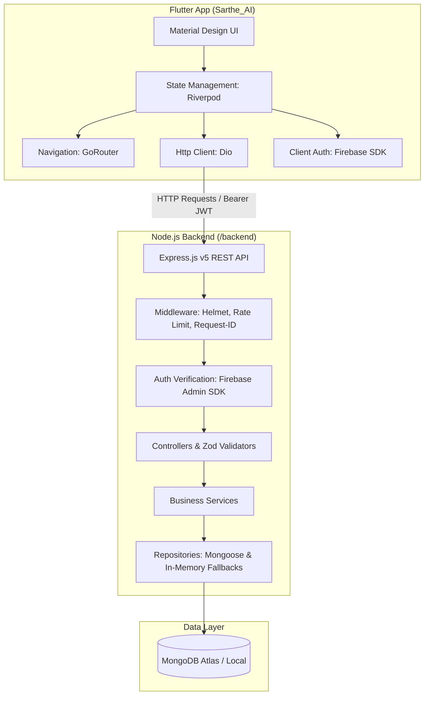

# Sarthee AI — System Architecture, End-to-End API Flow, Bug Analysis & Onboarding Guide

Welcome to **Sarthee AI**! This document provides a comprehensive technical breakdown of the codebase for new developers joining the team. It covers the product features, end-to-end API flow down to the database level, known bugs and architectural gaps, and recommended next steps for development.

---

## 1. Project Overview & Technology Stack

**Sarthee AI** is an intelligent, location-aware travel assistant and tourism companion designed to deliver personalized recommendations, cultural discovery, itinerary planning, local food insights, and real-time navigation.

### Repository Layout
The repository is structured as a full-stack monorepo:
* **Frontend**: [`Sarthe_AI`](file:///d:/Sarthee_AI_App/Sarthe_AI) (Flutter cross-platform application for Android, iOS, Web, Windows, macOS, Linux).
* **Backend**: [`backend`](file:///d:/Sarthee_AI_App/backend) (Node.js & Express.js RESTful API).

### Core Technology Stack



| Layer | Technologies & Libraries Used |
| :--- | :--- |
| **Frontend Framework** | Flutter SDK (^3.12), Dart (^3.12) |
| **Frontend State & Router** | `flutter_riverpod` (^2.6), `go_router` (^17.3) |
| **Frontend Networking & Storage**| `dio` (^5.11), `flutter_secure_storage` (^10.3), `shared_preferences` (^2.5) |
| **Frontend Auth & Location** | `firebase_auth` (^6.5), `google_sign_in` (^7.2), `geolocator` (^14.0) |
| **Backend Runtime & API** | Node.js (>=20.0), Express.js (^5.2, ES Modules) |
| **Backend Database & ORM** | MongoDB, Mongoose (^9.8) |
| **Backend Auth & Validation** | `firebase-admin` (^14.2), `zod` (^4.4) |
| **Logging & Security** | `pino` (^10.3), `pino-http` (^11.0), `helmet` (^8.3), `express-rate-limit` (^8.6) |

---

## 2. End-to-End Architecture: From Request to Database

The backend follows a **Modular Monolithic Layered Architecture** with strict separation of concerns:

```
[HTTP Client / Flutter App]
         │
         ▼
[1. Server Entry] ──> server.js (Lifecycle, Process Signal Traps, Graceful Shutdown)
         │
         ▼
[2. Express Core]  ──> app.js (Security Headers, Rate Limiting, Request ID, Pino Logging)
         │
         ▼
[3. Router Registry] ──> src/api/v1/routes/index.js (API Gateway & Mounting)
         │
         ▼
[4. Authentication] ──> firebase-auth.middleware.js (Bearer Token Verification via Firebase Admin)
         │
         ▼
[5. Request Validation] ──> *.validator.js (Zod Schema Validation for Query/Body/Params)
         │
         ▼
[6. Controller]     ──> *.controller.js (HTTP Request/Response Handling & Status Codes)
         │
         ▼
[7. Service]        ──> *.service.js (Pure Business Logic & Domain Orchestration)
         │
         ▼
[8. Repository]     ──> *.repository.js (Data Access Layer: MongoDB Mongoose / In-Memory Fallback)
         │
         ▼
[9. Database]       ──> MongoDB Atlas (Configured with Custom DNS fallback in database.js)
```

### Detailed Execution Sequence

1. **Client Execution**:
   - The Flutter app initializes an HTTP request via singleton [`ApiClient`](file:///d:/Sarthee_AI_App/Sarthe_AI/lib/core/network/api_client.dart).
   - Dio's request interceptor fetches the stored Firebase JWT token from [`SecureStorage`](file:///d:/Sarthee_AI_App/Sarthe_AI/lib/core/storage/secure_storage.dart) and attaches header `Authorization: Bearer <token>`.
2. **Server Entry & Middleware Gateway**:
   - Request reaches [`app.js`](file:///d:/Sarthee_AI_App/backend/src/app.js).
   - `requestIdMiddleware` injects `x-request-id` header for request tracing.
   - `helmet` sets HTTP security headers; `rateLimitMiddleware` enforces client request rate limits.
   - `pino-http` logs request details asynchronously.
3. **Route & Auth Guard**:
   - Request is routed through [`src/api/v1/routes/index.js`](file:///d:/Sarthee_AI_App/backend/src/api/v1/routes/index.js).
   - Protected routes invoke [`firebaseAuthMiddleware`](file:///d:/Sarthee_AI_App/backend/src/middleware/firebase-auth.middleware.js). The token is verified using `firebaseAdmin.auth().verifyIdToken()`, attaching `req.user = { id, uid, email, ... }`.
4. **Validation & Controller**:
   - Input payloads pass through Zod validators (e.g., [`user.validator.js`](file:///d:/Sarthee_AI_App/backend/src/modules/auth/user.validator.js)).
   - Controller handles response formatting (`200 OK`, `201 Created`).
5. **Service & Repository Layer**:
   - Service executes domain logic (e.g., user profile creation/synchronization).
   - Repository handles data access. If database connection is active, queries run via Mongoose models (e.g. [`User`](file:///d:/Sarthee_AI_App/backend/src/modules/auth/user.model.js)). For modules like [`home.repository.js`](file:///d:/Sarthee_AI_App/backend/src/modules/home/home.repository.js), a fallback deterministic in-memory structure provides seed content if database collections are unpopulated.

---

## 3. Feature Implementation Matrix

| Module / Feature | Backend Implementation Status | Frontend Implementation Status | Status |
| :--- | :--- | :--- | :--- |
| **Authentication & Sync** | [`auth.routes.js`](file:///d:/Sarthee_AI_App/backend/src/modules/auth/auth.routes.js), `user.service.js`, `user.repository.js`, `User` model | `LoginPage`, `SignupPage`, `AuthService`, `AuthSyncService` | **Active & Functional** |
| **User Profile Management** | `GET/PUT /api/v1/auth/profile` endpoints | `ProfilePage`, `EditProfilePage`, `ProfileSetupPage`, `ProfileCompletionProvider` | **Active & Functional** |
| **Home Experience Feed** | [`home.routes.js`](file:///d:/Sarthee_AI_App/backend/src/api/v1/routes/home.routes.js), `home.service.js`, `home.repository.js` | `AppShell` navigation shell, basic feed state | **Active / Initial Feed** |
| **Location Tracking** | Coordinates query parsing in `home` module | `geolocator` integration, `LocationPage` | **Active** |
| **AI Assistant ("Ask Sarthee")** | 0-byte file [`ai.routes.js`](file:///d:/Sarthee_AI_App/backend/src/api/v1/routes/ai.routes.js) | Placeholder page `SartheeRoutePlaceholderPage` | ⚠️ **Stubbed / Unimplemented** |
| **Destinations Discovery** | 0-byte file `destinations.routes.js` | Placeholder page `SartheeRoutePlaceholderPage` | ⚠️ **Stubbed / Unimplemented** |
| **Trip Planner** | 0-byte file `trips.routes.js` | Placeholder page `SartheeRoutePlaceholderPage` | ⚠️ **Stubbed / Unimplemented** |
| **Culture & Heritage** | 0-byte file `culture.routes.js` | Placeholder page `SartheeRoutePlaceholderPage` | ⚠️ **Stubbed / Unimplemented** |
| **Local Food Discovery** | 0-byte file `food.routes.js` | Placeholder page `SartheeRoutePlaceholderPage` | ⚠️ **Stubbed / Unimplemented** |
| **Hotels & Stays** | 0-byte file `hotels.routes.js` | Placeholder page `SartheeRoutePlaceholderPage` | ⚠️ **Stubbed / Unimplemented** |
| **Budget Planner** | 0-byte file `budget.routes.js` | Placeholder page `SartheeRoutePlaceholderPage` | ⚠️ **Stubbed / Unimplemented** |
| **Weather Updates** | 0-byte file `weather.routes.js` | Placeholder page `SartheeRoutePlaceholderPage` | ⚠️ **Stubbed / Unimplemented** |

---

## 4. Known Bugs, Codebase Errors & Gaps

> [!WARNING]
> The following list details critical bugs, stubbed files, and architectural gaps discovered during codebase inspection:

### Backend Bugs & Gaps
1. **Unmounted & Empty Feature Route Files**:
   - In [`src/api/v1/routes/index.js`](file:///d:/Sarthee_AI_App/backend/src/api/v1/routes/index.js), 9 out of 12 route modules (`destinations`, `culture`, `food`, `hotels`, `favorites`, `trips`, `budget`, `weather`, `navigation`, `ai`) are commented out.
   - The corresponding files in `src/api/v1/routes/` and `src/api/v1/controllers/` are **0-byte empty files**.
   - Corresponding module subdirectories under `src/modules/` (e.g. `src/modules/ai`, `src/modules/destinations`, `src/modules/trips`) are **completely empty directories**.
2. **Missing Database Models for Core Domain Entities**:
   - Currently, only [`user.model.js`](file:///d:/Sarthee_AI_App/backend/src/modules/auth/user.model.js) exists in Mongoose. Models for `Destination`, `Trip`, `Culture`, `Food`, `Hotel`, `Budget`, and `ChatMessage` are missing.

### Frontend Bugs & Gaps
1. **Duplicate Auth Folder Structure**:
   - The Flutter project contains both [`lib/features/auth`](file:///d:/Sarthee_AI_App/Sarthe_AI/lib/features/auth) (active auth implementation) and [`lib/features/authentication`](file:///d:/Sarthee_AI_App/Sarthe_AI/lib/features/authentication) (contains empty `data`, `domain`, `presentation` folders with 0-byte files).
2. **Hardcoded API Base URL in Frontend**:
   - In [`api_client.dart`](file:///d:/Sarthee_AI_App/Sarthe_AI/lib/core/network/api_client.dart#L21), the default fallback URL is hardcoded to `https://sarthee-ai.onrender.com/api/v1`. If local backend is running on `http://localhost:5000`, the app attempts to hit production unless `--dart-define=API_BASE_URL=...` is specified explicitly.
3. **Empty Stub Files in Core Network**:
   - Core network directory `lib/core/network/` contains several 1-byte empty files (`api_endpoints.dart`, `network_exception.dart`, `network_info.dart`, `network_interceptor.dart`).
4. **Placeholder Screens in App Router**:
   - In [`app_router.dart`](file:///d:/Sarthee_AI_App/Sarthe_AI/lib/app/router/app_router.dart), all primary navigation tabs (Home, Destinations, Culture, Food, Sarthee AI, Trips, Profile) use `SartheeRoutePlaceholderPage` instead of full UI screen widgets.
5. **Commented Out App Lifecycle Handlers**:
   - In [`main.dart`](file:///d:/Sarthee_AI_App/Sarthe_AI/lib/main.dart#L89-L94), session re-validation code on application resume (`AuthBootstrapService.instance.resetSessionValidation()`) is commented out.

---

## 5. Developer Action Plan & Suggestions

> [!TIP]
> Prioritized roadmap for new developers working on Sarthee AI:

### Phase 1: Environment & Technical Debt Cleanup
- [ ] **Dynamic Local API Base URL**: Update `api_client.dart` to check `kDebugMode` and automatically default to `http://10.0.2.2:5000/api/v1` (Android Emulator) or `http://localhost:5000/api/v1` (Desktop/Web) when running locally.
- [ ] **Remove Duplicate Directories**: Clean up empty folder [`lib/features/authentication`](file:///d:/Sarthee_AI_App/Sarthe_AI/lib/features/authentication).
- [ ] **Implement Core Network Helpers**: Complete `api_endpoints.dart` and `network_exception.dart` to unify endpoint constants and Dio error mapping.

### Phase 2: Feature Module Implementation (AI Assistant & Destinations)
- [ ] **Build AI Assistant Module ("Ask Sarthee")**:
  - Implement LLM integration (Google Gemini API SDK / OpenAI) in `backend/src/modules/ai`.
  - Build interactive chat UI in Flutter (`lib/features/ai_chat/presentation/pages/ai_chat_page.dart`).
- [ ] **Build Destinations & Trip Modules**:
  - Create Mongoose schemas (`Destination`, `Trip`, `Itinerary`) and controllers in backend.
  - Implement real Flutter screens to replace `SartheeRoutePlaceholderPage` in `app_router.dart`.

### Phase 3: Database Seeding & Testing
- [ ] **Seed Script for Tourism Data**: Write a seeding script in [`backend/scripts/seed.js`](file:///d:/Sarthee_AI_App/backend/scripts/seed.js) to populate initial destinations, cultural sites, and food recommendations.
- [ ] **Add Frontend Integration Tests**: Write widget tests and provider unit tests in `Sarthe_AI/test/`.
